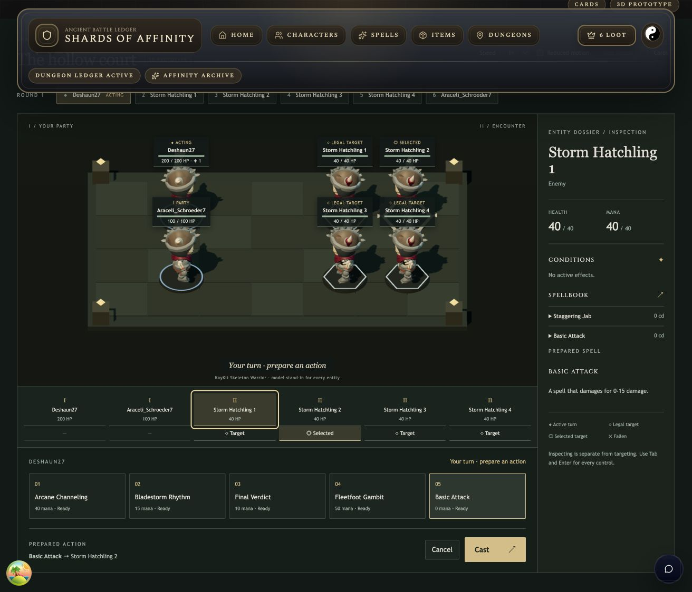
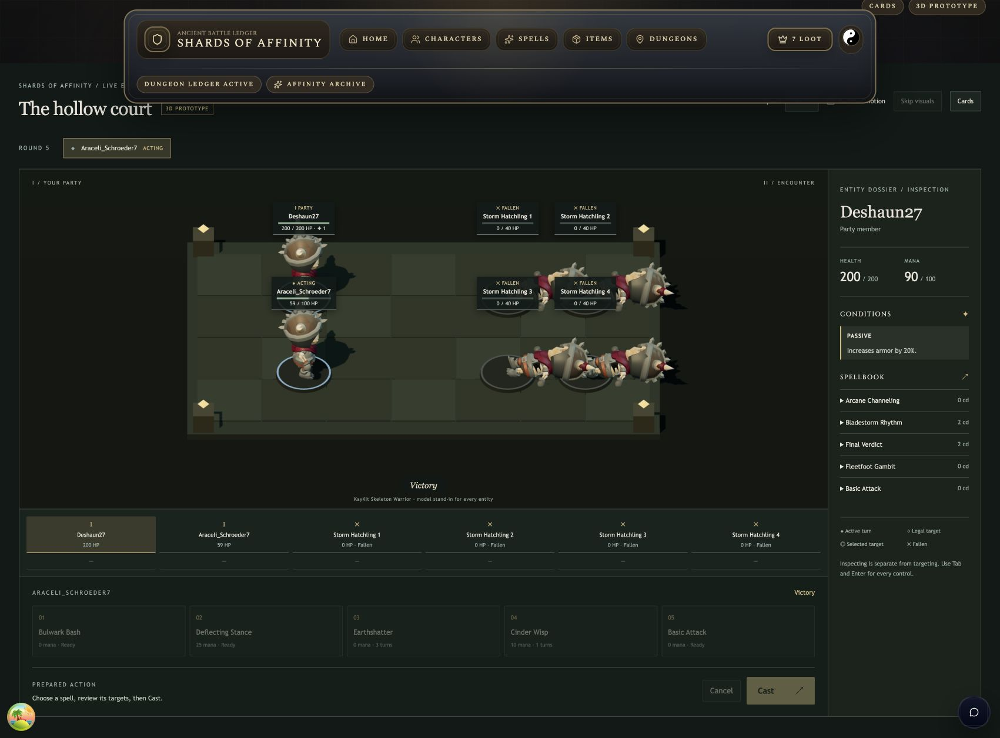
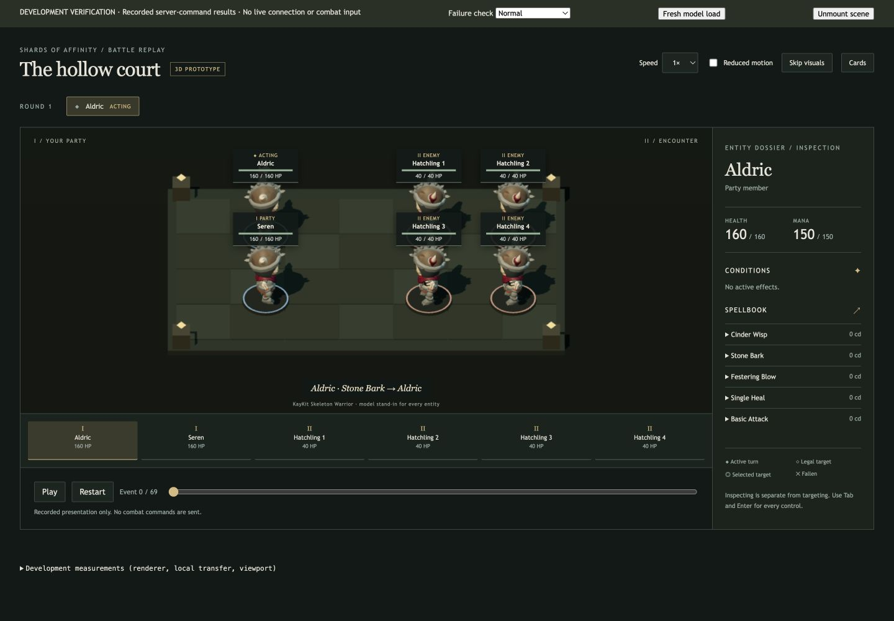
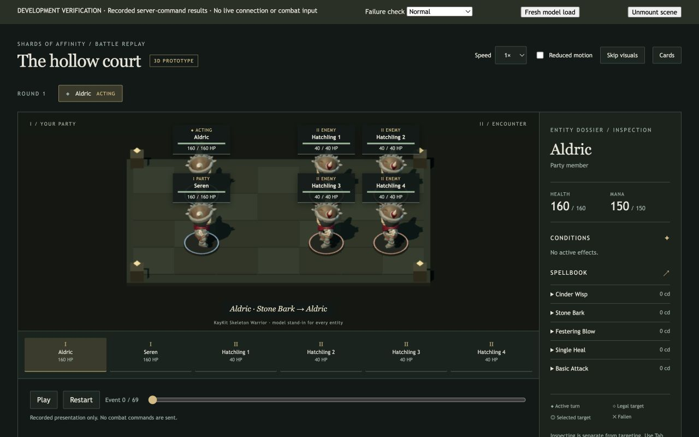
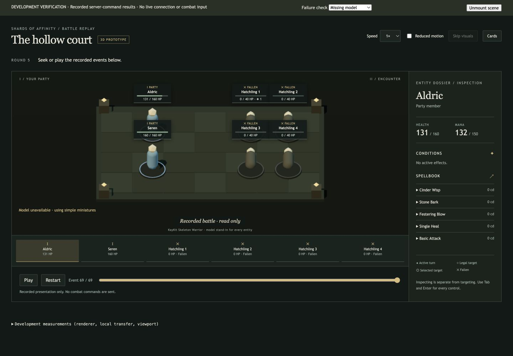
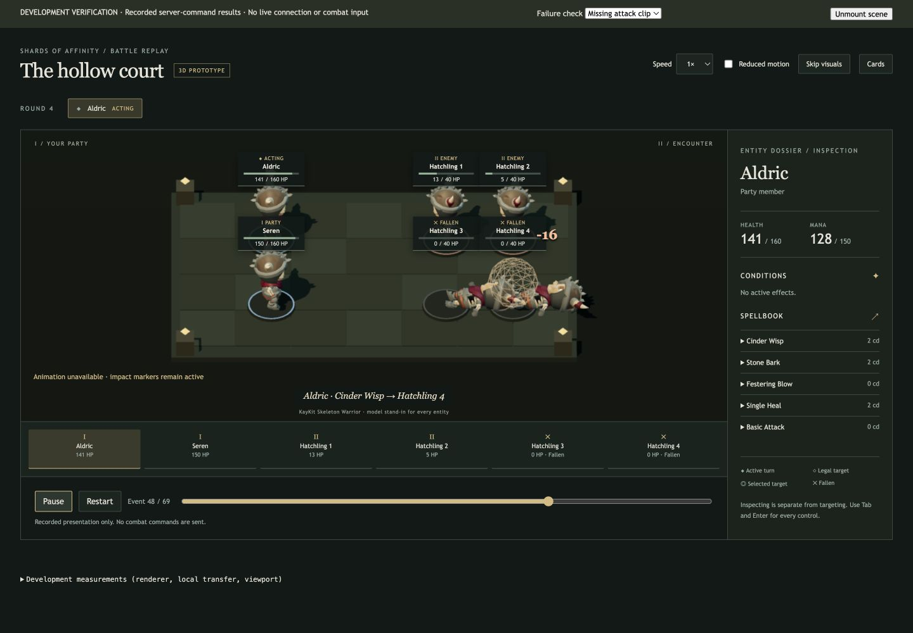
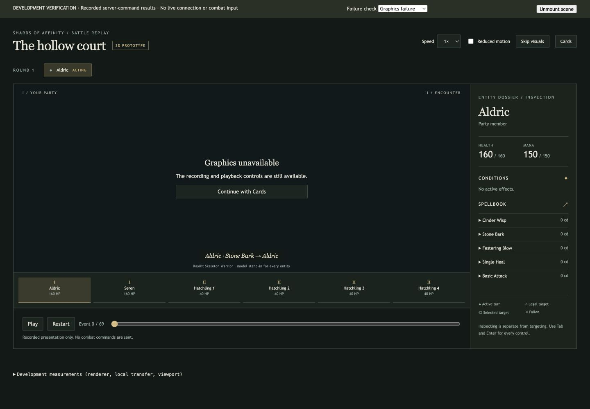

# Browser acceptance and feasibility evidence

> Archived reference. Observations, proposed work and source paths describe the original dated snapshot. Use the [release checklist](../../../release-checklist.md) for current requirements.

Recorded 2026-09-09 on a MacBook Pro (MacBookPro18,2), Apple M1 Max, 32 GB RAM. Live play used the signed-in Codex in-app browser against the Vite/Worker development servers and local PostgreSQL. Controlled rendering samples used the browser reporting Chrome 152.0.0.0 on macOS, at 1440×1000 and 1280×800 CSS pixels.

## Authenticated live fighting

Both encounters were started through the existing dungeon UI, played with real user-owned characters over the existing WebSocket, and completed through the existing persisted result flow.

| Encounter | Party | Accepted player casts | Resolved events | Outcome |
| --- | --- | ---: | ---: | --- |
| Avalanche Lair, first battle | Araceli_Schroeder7, Wade.Runolfsdottir | 5 | 23 | Victory |
| Trial of the Storm, first battle | Deshaun27, Araceli_Schroeder7 | 7 | 60 | Victory |

The first fight exercised Cinder Wisp, Basic Attack and Deflecting Stance. Preparing Cinder Wisp left the goblin at 20 HP and the caster at 50 mana until Enter activated Cast. The resolved spell reduced the goblin to 9 HP. Enemy damage, mana regeneration, cooldown reduction, a selected-ally protective effect, its description/removal and death appeared in the real UI. Victory opened the stored result with the original starting HP intact.

The six-entity fight used mouse and keyboard input. Deshaun27 prepared Basic Attack on **Storm Hatchling 2**, then inspected **Storm Hatchling 1**; the prepared target remained number 2. The server recorded 14 damage only on number 2 (40→26 HP, then its normal 2 HP regeneration produced the displayed 28 HP). Final Verdict and Bladestorm Rhythm killed selected enemies. Earthshatter automatically selected the complete surviving enemy team, numbers 3 and 4, and waited for Cast. Cinder Wisp and the last Final Verdict completed the fight. Final saved resources were Deshaun27 200 HP / 90 mana and Araceli_Schroeder7 59 HP / 40 mana, with all four enemies dead.

Cards/3D switches preserved the same battle and produced no extra casts. Development reloads exercised socket recovery and starting-build reconstruction without resending previous commands. A renderer context loss during development retained controls and allowed a return through Cards. Result persistence and workflow reward completion succeeded locally. No subsequent dungeon waves were played.

The accepted command logs, frozen builds and saved server results are in `tests/battle/recordings/live-goblin.json` and `live-six-entity.json`. Regression tests reproduce their final engine resources and separately verify that the presentation adapter matches the persisted results. User IDs are pseudonymized; no tokens or secrets are included.

These native live captures reflect the app's actual viewport during the run (1312×1124 for the prepared action, 1701×1257 for the final victory). The app was resized during the session. Its existing sticky navigation occupies a substantial part of the screen; lower controls remain reachable by scrolling.

## Controlled rendering samples

These samples use the same 3D scene and playback adapter with a saved six-entity command recording. They measure rendering separately from network wait or live combat resolution. The recording includes damage, healing, a complete-team attack, effects/trigger/removal, mana, cooldowns and deaths. No browser-local combat calculation supplies the results.

| Sample | Active frames retained | Median frame interval | p95 | Maximum |
| --- | ---: | ---: | ---: | ---: |
| 1440×1000, 1× playback | 1,800 | 16.7 ms | 17.7 ms | 22.3 ms |
| 1280×800, 1× playback | 1,800 | 16.7 ms | 17.8 ms | 23.1 ms |

The active bucket records frames only while a resolved cue is playing, and keeps the latest 1,800 frames, approximately 30 seconds here. Both samples included SPELL_CAST, EFFECT_TRIGGER, EFFECT_REMOVAL, REGEN, REDUCE_SPELL_COOLDOWN and DEATH. A separate rolling bucket records idle and active frames. These are requestAnimationFrame intervals, not GPU timer queries. They show behavior close to 60 fps on this device, with some frames exceeding the 16.7 ms target; they do not establish an unconditional sustained 60 fps.

Raw samples: [1440 active](metrics-1440-active.json), [1280 active](metrics-1280-active.json). Normal idle samples were also around 16.7 ms median. Entry/remount samples showed spikes up to 58.7 ms, so the smooth warm result should not be read as absence of startup stalls.

A fresh GLB URL (application and driver caches warm) measured:

- Response transfer: **4,863,920 bytes**, including approximately 300 bytes of response overhead; encoded asset body **4,863,620 bytes**.
- Local model response duration: **26.5 ms**.
- HTML controls mounted **60.5 ms** after navigation start.
- Imported model ready **248.5 ms** after navigation start.

See [fresh-model timing](metrics-fresh-model.json). This measures a fresh model request over localhost, not a cold production navigation, remote connection, or live WebSocket RTT. An earlier development load showed model readiness around 1.42 seconds; local warm timings are not a download SLA.

The renderer uses a fixed orthographic camera, explicit PCF shadows, standard materials and a DPR cap of 1.5. At a settled starting frame it reports 181 draw calls, 73,110 triangles, 67 geometries and 58 textures. A completed frame has one fewer active-turn marker: 180 calls, 73,102 triangles and 66 geometries. The texture count includes independent skinning resources.

The smaller image captures the 1280×800 viewport, showing the battlefield, entity controls, inspector and replay controls. All six labels remain readable; the inspector footer continues below the viewport. Long live names wrap; duplicate enemy names receive formation ordinals. The page is intentionally scrollable at shorter desktop heights. Mobile was not qualified.

## Failure and control checks

The development replay toolbar offers Normal, Missing model, Missing attack clip and Graphics failure checks. These exercise the actual fetch/parser, missing-clip and renderer error-boundary paths. They do not change combat logic.

- Missing model: six simple miniatures, explicit fallback status, functional inspection and replay skip to the correct final state.
- Missing attack clip: original models retained; playback continued with independent impact markers and the remaining imported clips.
- Graphics failure: error state retained the surrounding HTML controls and exposed the Cards fallback. Normal mode restored the scene.
- Reduced motion: idle/lunge motion suppressed; clear impact/resource/fallen state retained. Play/pause, restart, keyboard seek and visual skip were exercised separately from live input.
- Four independent copies of the original GLB passed the skeleton/mixer test; a one-shot reset returns to the same intermediate pose without moving siblings. The browser scene displayed six separately marked instances.

## Checks and practical limits

`bun run test:battle`: **35 passed**, 209 assertions across seven files. Both client and server TypeScript checks pass. The clean production build passed in approximately 5.2 seconds, with no emitted 3D scene JavaScript chunk. Existing large main-bundle warnings remain (about 794 KB and 1.26 MB before gzip). Public GLB files remain static build assets, without being fetched by unrelated navigation.

React Doctor's tracked-change scan scored 84/100, up from 53 earlier in this implementation. The full scan, including new files, reported zero errors and 90 warnings across the application. Remaining warnings include existing accessibility/complexity issues, bounded six-entity array lookups, the deliberate GLTF asset effect/cache, and scene status propagation. These scores are tooling signals, not a claim that the full application has been audited or cleaned up.

Self-target and healing behavior, rejection cases, spectators, stale replies and disconnects during an uncertain cast have automated real-handler/session coverage. The two live loadouts exercised selected-ally buffs and whole-enemy-team input; they did not provide a live self-only spell or player heal. Browser recovery was checked through development reloads; a throttled network matrix, production latency, heap/GC profiling, mobile/touch, other devices and audio remain unqualified or out of scope.

The skeleton is a deliberate stand-in for all entities. The unmodified 95-clip model is large for a single miniature; trimming unused clips/meshes and verifying one party model plus one real enemy model is the recommended next milestone. Improve the elevated camera's face/silhouette readability and reclaim screen space from the existing navigation before expanding visual variants. The observed live command boundary is already connected and playable.

## Repeated scene entry and exit

Five explicit unmount → wait beyond the one-second last-owner eviction → mount cycles were measured at the same paused starting frame. Each settled at **67 geometries, 58 textures, 181 draw calls and 73,110 triangles**. The GLB request count advanced from 2 through 6, confirming repeated loads after eviction. The visible renderer counts stayed flat across all five cycles; see [raw cycle data](resource-cycles.json). This is evidence against progressive renderer-resource growth in this sample, not a browser heap/GC audit.
