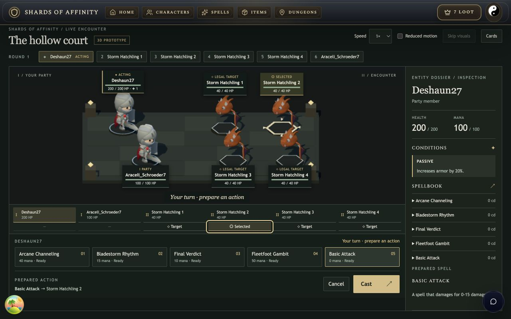
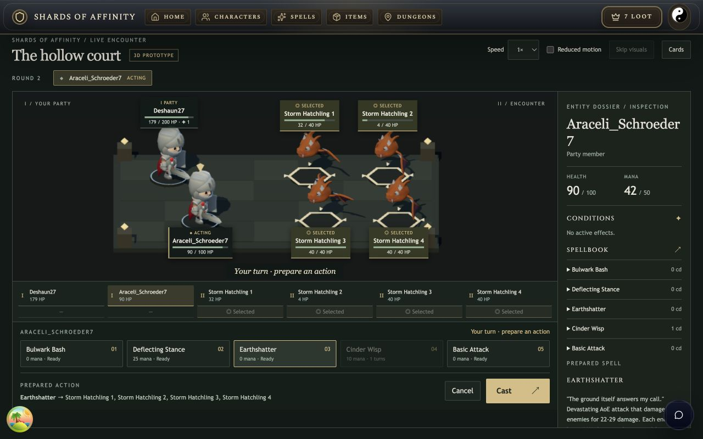
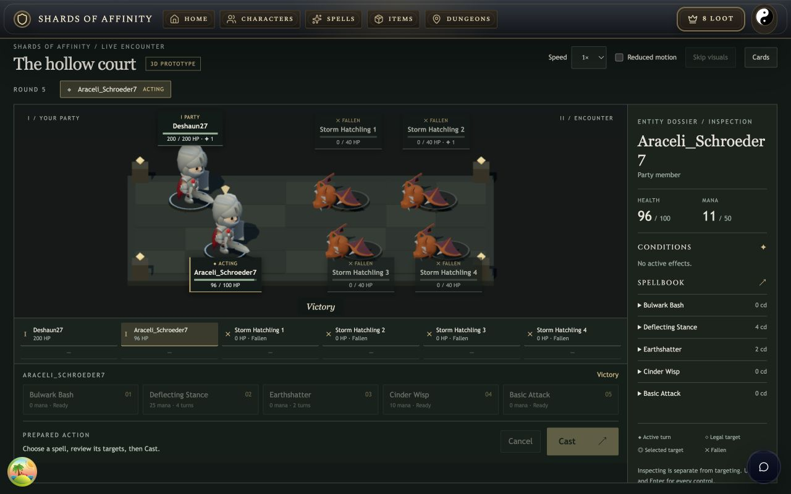
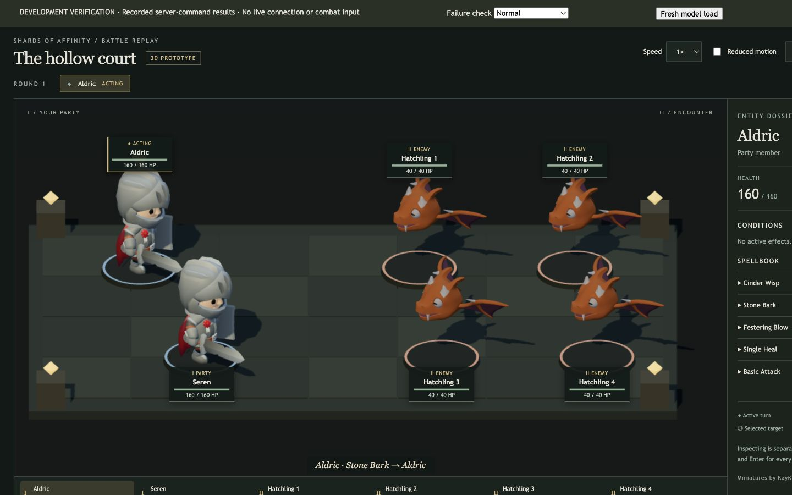
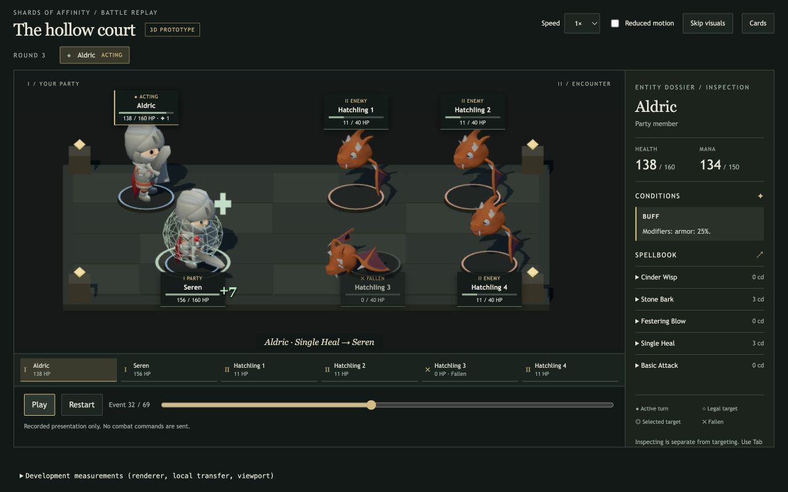
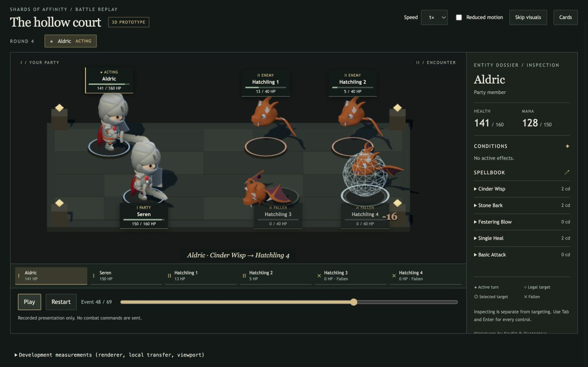
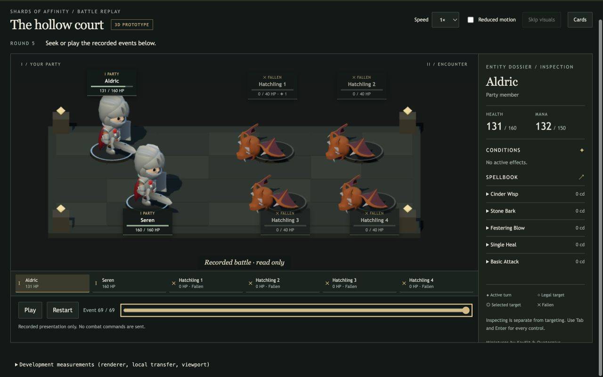

# Milestone 2: readable miniatures and lighter assets

> Archived reference. Observations, proposed work and source paths describe the original dated snapshot. Use the [release checklist](../../../release-checklist.md) for current requirements.

Implemented and exercised locally on 2026-09-09. The party now uses animated KayKit knights, and enemies use Quaternius dragons. The camera shows faces more clearly, foreground labels sit below the bases, and the compact live layout keeps the Cast button visible at 1280×800. Melee, magic, protection and healing have distinct feedback driven only by resolved battle events.

This is still the development-only 3D prototype. All party members share the knight appearance and enemies share the dragon appearance; class, equipment and enemy-species variants are not implemented. The dragon's Punch clip is a documented generic casting substitute. Both assets are CC0; see [provenance, clip mappings and reproduction steps](../../../../apps/client/public/models/battle-v2/PROVENANCE.md).

## Live acceptance

Trial of the Storm was started and played through the existing authenticated local UI with Deshaun27 and Araceli_Schroeder7 against four storm hatchlings. The real server accepted **9 casts**, produced **62 events**, and persisted **Victory**. No subsequent wave was played.

[Open the saved local result](http://127.0.0.1:3001/battle/finished/lb7sxdh9cct5). The portable command/result capture is [live-milestone-2.json](../../../../tests/battle/recordings/live-milestone-2.json); account IDs are pseudonymized. Its regression test restores frozen builds, executes the accepted commands through the real engine and independently compares presentation resources with the saved result.

| Cast | Character | Spell | Resolved target |
| --- | --- | --- | --- |
| 1 | Deshaun27 | Basic Attack | Hatchling 2 |
| 2 | Araceli_Schroeder7 | Cinder Wisp | Hatchling 1 |
| 3 | Deshaun27 | Final Verdict | Hatchling 2 |
| 4 | Araceli_Schroeder7 | Earthshatter | All four surviving hatchlings |
| 5 | Deshaun27 | Bladestorm Rhythm | Hatchling 1 |
| 6 | Araceli_Schroeder7 | Cinder Wisp | Hatchling 3 |
| 7 | Deshaun27 | Basic Attack | Hatchling 3 |
| 8 | Araceli_Schroeder7 | Deflecting Stance | Deshaun27 |
| 9 | Deshaun27 | Final Verdict | Hatchling 4 |

The final result has Deshaun27 at **200 HP / 90 mana**, Araceli_Schroeder7 at **96 HP / 11 mana**, and all enemies dead. Preparation, changing spells, team targeting and keyboard Enter on target/Cast controls were exercised at normal playback speed. Preparing Arcane Channeling and changing to Final Verdict did not send an extra cast. The loadout did not contain a player heal; healing feedback is exercised by the saved command recording.

At 1280×800 the prepared live Cast button occupied y=701.4–746.3, fully inside the viewport. The main navigation remains available in the compact battle header. The inspector scrolls when needed.

## Asset and rendering comparison

Same desktop as the [milestone-1 baseline](../threejs-evidence/README.md): MacBookPro18,2, Apple M1 Max, 32 GB RAM, controlled browser reporting Chrome 152.0.0.0 on macOS. The recording contains two party members and four enemies. DPR remains capped at 1.5, with the same PCF shadow setting. The scene size, geometry and camera changed with this milestone.

| Model data | Milestone 1 | Milestone 2 |
| --- | ---: | ---: |
| GLB body bytes | 4,863,620 | 717,404 |
| Runtime models | 1 | 2 |
| Retained animation clips | 95 | 6 knight + 5 dragon |
| Settled starting draw calls | 181 | 111 |
| Settled starting triangles | 73,110 | 59,742 |
| Settled starting geometries | 67 | 70 |
| Settled starting textures | 58 | 21 |

The knight is 488,568 bytes and the dragon 228,836 bytes, an **85.25% reduction** in combined model body size. The preparation script checks source hashes, removes alternate knight accessories and unused clips, resamples redundant keys, deduplicates and prunes data. It preserves geometry/texture precision and needs no browser compression decoder. Exact hashes are in [build-report.json](../../../../apps/client/public/models/battle-v2/build-report.json). The previous 4.86 MB GLB has been removed from public assets.

A fresh model URL with application/driver caches warm fetched 718,004 bytes including response overhead. Local response duration was 16.4 ms for the knight and 11.8 ms for the dragon; HTML controls mounted at 53.0 ms and both imported models were ready at 210.4 ms after navigation. The corresponding baseline was 60.5 ms for controls and 248.5 ms for the single model. These are individual localhost samples, not a remote or cold-start download guarantee. See [fresh request measurements](metrics-fresh-model.json).

| Normal 1× playback | Active frames | Median | p95 | Maximum | Baseline p95 |
| --- | ---: | ---: | ---: | ---: | ---: |
| 1440×1000 | 1,800 | 16.7 ms | 19.1 ms | 27.2 ms | 17.7 ms |
| 1280×800 | 1,800 | 16.7 ms | 19.7 ms | 28.1 ms | 17.8 ms |

Both active samples include spell casts, effect triggers/removals, regeneration, cooldown reduction and death. They retain the latest 1,800 active frames, approximately 30 seconds, and measure requestAnimationFrame intervals rather than GPU time. Median pacing remained near 60 fps; the slower tail increased despite lower draw-call and texture counts. Neither milestone demonstrates a strict sustained 60 fps. No build or test process ran during these samples. Raw data: [1440](metrics-1440-active.json), [1280](metrics-1280-active.json).

## Replay, failure and cleanup checks

The [development recording page](http://127.0.0.1:3001/dev/battle-replay.html) uses saved authoritative results and cannot submit combat commands.

- Normal playback and 4× playback reached event 69 with Aldric at 131/160 HP, Seren at 160/160 HP and four defeated enemies. Keyboard seeking, pause/restart, reduced motion and Skip visuals reached the same final display state. Seeking directly to the end now settles the imported death pose even while paused.
- Single Heal visibly applied the recorded +7 to Seren, with the knight's casting pose, green seal, stationary cross and health update. The cross sits clear of the model instead of rotating with the floor seal. Cinder Wisp displayed feedback only on its recorded target. The live fight and recorded playback also exercised melee and whole-team feedback.
- Missing knight model left the four animated dragons usable, replaced only the party with simple miniatures, displayed the asset error, and retained inspection/skip controls. It reached the correct final resources.
- Missing knight attack clip retained both models, reported the unavailable animation and continued through recorded melee actions with impact/state feedback.
- Graphics failure retained accessible playback and inspection controls and the Cards fallback. The recording harness's Cards callback unmounted the scene; returning to Normal restored rendering. The live/result routes retain their existing Cards view.
- Five unmount → wait beyond the one-second eviction → mount cycles each settled at **70 geometries, 21 textures, 111 draw calls and 59,742 triangles**. The two-model request count advanced **4, 6, 8, 10, 12**, confirming renewed requests after cache eviction. Counts did not grow across cycles. This is a renderer resource check, not a browser heap/GC audit. Cycle frame times are not performance samples; final build/type/test checks ran during part of this cleanup check. See [raw cycle data](resource-cycles.json).

Failure captures: [one missing model](missing-model.jpg), [missing clip](missing-clip.jpg), [graphics fallback](graphics-fallback.jpg), [reduced-motion final state](reduced-motion-final.jpg).

## Validation and remaining limits

`bun run test:battle`: **39 passed**, 267 assertions across seven files. Client and server TypeScript checks pass. The production build passes and emits the two current static GLBs, with the old skeleton GLB and development 3D JavaScript chunk absent. Existing large main-bundle warnings remain, approximately 794 KB and 1.26 MB before gzip. Public GLBs are copied into the build but are not requested by ordinary navigation.

The complete React Doctor scan scored **54/100, 94 warnings and no errors**, compared with **53/100 and 90 warnings** for an isolated copy of commit `81df60d` using the same scan scope. The earlier tracked-diff score excluded untracked files and is not comparable. The four additional diagnostics are the color-helper export, one bounded six-entity lookup, repeated metadata property access, and a frame-delta warning on `SpellTrace`. The latter is a false positive: elapsed time, travel, rotation and scale use the supplied frame delta. The others are low-impact organization/performance suggestions at this scene size. Existing application accessibility and complexity warnings remain; this was not an application-wide cleanup.

Asset checks validate both GLBs, clip mappings and positive durations, independent cloned skeletons and repeated one-shot resets. Timeline tests cover the new visual categories and correctly label join-time passive events without fabricating a Basic Attack. The new live fixture verifies persisted results and deterministic restoration through actual command handlers.

Browser heap/GC profiling, remote network latency, mobile/touch, additional hardware and audio remain outside the qualification. The work has not been deployed or committed as part of milestone 2.
