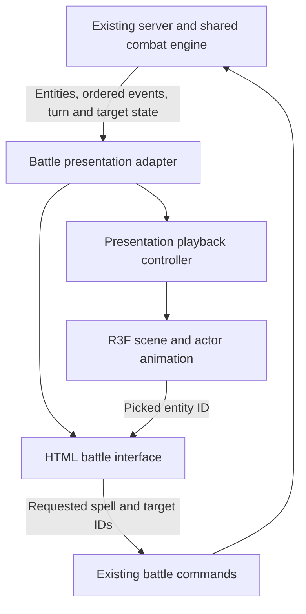

# Using Three.js for Shards of Affinity

> Archived reference. Observations, proposed work and source paths describe the original dated snapshot. Use the [release checklist](../../release-checklist.md) for current requirements.

## Recommendation

Build the first 3D prototype as a **fixed-camera battle diorama inside the existing React client**, using stable React Three Fiber, a small selection of Drei helpers, and Three.js's WebGL renderer. Keep the existing TypeScript combat engine and server authority. Three.js should turn resolved battle events into character poses, attacks, effects, and readable feedback.

This recommendation follows the game's actual structure. Shards of Affinity currently has one or two party characters facing at most four enemies, sequential turns, and entity-based targeting. It has no movement, weapon reach, collision, or line-of-sight rules. A staged battlefield can therefore explore how 3D improves its combat presentation without first inventing a different game. The [game overview](game-overview.md) and [content catalog](game-content-catalog.md) describe the current mechanics and content in detail.

The first experiment should answer three questions: can players identify whose turn it is and which targets are legal; can attacks, healing, and persistent effects remain understandable during playback; and can a six-actor scene run acceptably on the intended devices? Free movement, procedural worlds, physics, and a new combat rules system do not help answer those questions.

The software findings below are scoped to **9 September 2026**. Three.js r186 was released on 8 September; React Three Fiber 9.7.0 and Drei 10.7.8 are the stable integration versions examined. Package compatibility needs particular attention because the Three.js release is newer than those integrations.[^1][^2][^3] The architecture, asset conventions, performance targets, and work packages are recommendations for this repository, rather than claims that a prototype has already been implemented or benchmarked.

## 1. What Three.js provides

Three.js supplies the graphics building blocks for displaying an interactive 3D scene in a browser. A renderer draws a scene through a camera onto a canvas. A mesh combines geometry with a material; textures describe surface detail, lights illuminate suitable materials, and groups organize objects into transform hierarchies. Moving a parent group moves its children. Geometry and materials can be shared among multiple meshes.[^4]

| Concept | Role in the proposed battlefield |
| --- | --- |
| Scene | The room, actors, lights, and temporary visual effects. |
| Camera | The player's chosen view of the encounter. |
| Renderer | The graphics system drawing each frame. |
| Group / Object3D | A character's placement root and its child model, target marker, and effect anchors. |
| Mesh / geometry | A visible body, platform, prop, projectile, or temporary placeholder. |
| Material / texture | Surface appearance, including color, roughness, and painted detail. |
| Animation mixer | Playback of a character model's animation clips. |
| Raycaster | Resolving a pointer position into an intersected scene object. |

The last two have dedicated APIs: `AnimationMixer` advances animation tracks, and `Raycaster` reports object intersections.[^5][^6] Neither API decides whether a character can cast a spell or how much damage it deals.

The repository already supplies most of the game systems that a graphics library does not supply: combat rules, enemy behavior, loadouts, progression, dungeon content, persistence, authentication, and battle networking. These should remain reusable by a card view, a 2D view, and a 3D view. Introducing a second entity/component architecture merely to draw six combatants would increase the number of representations that must agree.

### Direct Three.js or React Three Fiber

React Three Fiber, abbreviated R3F, is a React renderer for Three.js. It lets components describe scene objects and participate in a shared render loop. The [official introduction](https://r3f.docs.pmnd.rs/getting-started/introduction) illustrates the relationship: a JSX `<mesh>` corresponds to a Three.js mesh, while React components organize state and interaction.[^41] Its `Canvas` creates the scene, camera, raycaster, and renderer; its hooks expose those objects when imperative control is needed.[^8]

| Option | Advantages for this project | Costs and limits | Assessment |
| --- | --- | --- | --- |
| Direct Three.js | Explicit ownership of renderer setup and object lifecycles; useful outside React. | Requires an integration layer for mounting, resizing, subscriptions, input, and cleanup alongside the React application. | A reasonable alternative if renderer independence becomes a requirement. |
| R3F with selected Drei helpers | Fits the existing React client; components can share the application's selection and display state; common loading and control utilities already exist. | React lifecycle and shared asset ownership still need care; examples must match the installed major version. | Recommended starting point. |
| WebGPU-first R3F | Access to the newer renderer's material and compute-oriented direction. | Adds a renderer-compatibility experiment before the game's presentation is established. | Evaluate separately if a specific visual requirement justifies it. |

The direct renderer exposes sizing, rendering, animation-loop, and disposal methods; R3F handles much of the corresponding integration work.[^9][^8] This is a maintainability judgment for a React application. It is not a measured claim that either integration is faster.

## 2. Versions and renderer choice

The client currently declares React and React DOM `^19.2.3`, Vite `^7.3.1`, and TypeScript-based source. It has no Three.js dependencies. The exact installed versions should be read from the lockfile when implementation begins; manifest ranges alone do not freeze an installation. See the [client manifest](../../../apps/client/package.json).

| Package | Version examined | Relevant evidence |
| --- | --- | --- |
| `three` | `0.186.0` / r186 | Released 8 September 2026.[^1] |
| `@react-three/fiber` | `9.7.0` stable | Its tagged manifest requires React and React DOM `>=19 <19.3`, and Three `>=0.156`.[^10] |
| `@react-three/drei` | `10.7.8` stable | Its tagged manifest requires R3F `^9.0.0`, React `^19`, and Three `>=0.159`.[^11] |
| R3F 10 | `10.0.0-alpha.5` | A prerelease, not the stable v9 API used in this report.[^2] |
| `@types/three` | `0.185.4` available during the compatibility check | Types are a separate dependency; `0.186.0` declarations were not yet published. Treat this as a known revision mismatch.[^7] |

**A wide peer range does not prove compatibility with a newly released dependency.** R3F 9.7.0's renderer configuration refers to `PCFSoftShadowMap`, while r186's release notes describe removal of that shadow mode.[^1][^12] The published npm `three@0.186.0` source retains the constant as deprecated; its shadow renderer warns and switches that mode to `PCFShadowMap`. An import check confirmed the export still exists, and the production bundle emitted no missing-export warning. The example uses `shadows="percentage"` to select PCF explicitly. Shadow appearance still requires a rendered check.

For implementation, begin with the core Three/R3F combination below, adding selected Drei helpers when needed. Do not silently combine R3F v10 examples with v9 packages. Avoid broad dependency upgrades while comparing art directions, since that would change the experiment's technical baseline.

### Compatibility evidence and initial installation

The exact TSX example in section 5 passed an isolated **Vite 7.3.1 production build** and a **TypeScript 5.9.3 strict check with dependency checking enabled**. The dependency set was React/React DOM 19.2.3, R3F 9.7.0, Three 0.186.0, and Three declarations 0.185.4, running under Node 24.19.0. The bundle produced a large-chunk warning. These results establish that the example compiles; they do not establish browser/GPU behavior, game integration, or model-loading performance.

The example imports no Drei helpers, so its successful type check does not validate Drei's dependency declarations. A separate sample importing Drei's `OrbitControls` failed dependency checking under TypeScript 5.9.3: resolved `three-stdlib@2.36.1` reported incompatible `SVGLoader` and `TGALoader` declarations. The [current client configuration](../../../apps/client/tsconfig.json) already uses `skipLibCheck`, which can hide those diagnostics; that is not proof that the declarations agree. Keep helper adoption inside the compatibility gate and record the runtime/declaration revision difference in upgrade notes.

For a future implementation, these commands select the core candidate from the repository root; they are instructions, not changes already made to the application:

```bash
cd apps/client
bun add --exact three@0.186.0 @react-three/fiber@9.7.0
bun add --dev --exact @types/three@0.185.4
# Add only when the chosen helper is needed and checked:
bun add --exact @react-three/drei@10.7.8
```

Preserve the resulting lockfile. Recheck the selected combination with one real model, independent actor copies, resize, selection, and shadows before accepting it as the prototype's runtime baseline.

### Why start with WebGL

Three.js's `WebGLRenderer` requires WebGL 2; WebGL 1 has been unsupported since r163.[^9] `WebGPURenderer` uses WebGPU where available and can fall back to WebGL 2. This is a backend fallback within the newer renderer, rather than a guarantee that every older material or helper behaves identically.[^13]

The r186 WebGPU manual still identifies compatibility limits: custom `ShaderMaterial`, `RawShaderMaterial`, and `onBeforeCompile` paths require adaptation, and the older `EffectComposer` stack does not transfer directly. It describes WebGLRenderer as maintained and suitable for WebGL 2 applications, while new renderer work concentrates on WebGPU, node materials, and TSL.[^14]

R3F v9 can initialize WebGPURenderer through an asynchronous `gl` factory. That establishes feasibility, but offers no specific advantage for six actors, a static room, and ordinary attack effects.[^8] Start with WebGL and standard materials. Reconsider WebGPU when a demonstrated requirement depends on its capabilities, and compare the same encounter under both backends.

## 3. A scene design that matches the game

Use an elevated fixed camera looking across a compact arena. Put the party on one side and enemies on the other, with enough separation to show targeting outlines, health changes, and body silhouettes. Each entity receives a stable presentation slot for the duration of the encounter. These positions have no combat meaning.

An orthographic camera keeps an object's apparent size independent of distance, which suits a board-like view.[^15] A restrained perspective camera is an alternative if depth and large enemies read better that way. Choose by comparing identical encounter fixtures, with identical HUD and animation timing. Free orbit can be useful in a development view, but should not be necessary to understand or operate a battle.

Preserve space around the arena for the existing HTML interface: abilities, health and mana, active effects, turn order, targeting instructions, chat, and connection state. Model silhouettes can communicate identity, but exact numbers and long descriptions remain easier to operate as ordinary interface elements. The DOM should also offer a target list so selecting a small or partially obscured model is never the only way to take a turn.

The game's spell themes can guide a visual vocabulary: fire as a warm burst, lightning as a sharp arc, water as a flowing projectile or heal, earth as a compact impact, and dark as a smoky pulse. These are proposed art directions. The existing damage types are physical and magical; introducing colored effects must not imply a new elemental weakness system. Similarly, an attack lunge can be a temporary animation that returns to the actor's slot without introducing movement rules.

For the first playable scene, use one room, two party actors, and up to four enemy actors. Start with primitive shapes and readable labels. Replace one actor with a finished animated model before commissioning a complete enemy set. Four copies of the same model are especially valuable for revealing shared-skeleton and shared-material mistakes.

## 4. Connect the scene to the existing battle system

The important boundary is between **combat state** and **presentation time**. The server determines results. A client adapter organizes those results into visible steps. The scene animates the current step. Changing frame rate, pausing playback, or disabling effects must never change damage, RNG consumption, cooldowns, or the next legal action.



### Existing integration points

The [battle hook](../../../apps/client/src/routes/battle/-hooks/use-battle.ts) already receives entity and state messages, requests legal targets, and submits `castSpell` commands. The [stats timeline](../../../apps/client/src/routes/battle/-hooks/use-stats-timeline.ts) reconstructs display values from ordered events and maps spell instance IDs to their casters. The [WebSocket contract](../../../apps/server/src/durable-objects/battle-ws.ts) carries `events`, the current round, and `effectTracking`.

These are useful integration points, but the current hook also mixes transport, playback, selection, timers, and navigation. Its one-second event timer and five-second post-battle redirect should not become the 3D animation scheduler. The prototype should place a presentation controller between the received data and both visual views, while preserving the existing command path.

Do not place meshes or Three.js objects in `apps/game`, persisted battle state, or WebSocket messages. Use runtime entity IDs as the bridge. A possible client-only division is:

| Proposed responsibility | Data and behavior it owns |
| --- | --- |
| Battle presentation adapter | Converts existing event payloads and metadata into stable display frames and visual cues. |
| Playback controller | Play, pause, speed, skip, seek, catch-up, and interruption of visual sequences. |
| Battle scene | Camera, placement slots, room, lights, and pointer-to-entity mapping. |
| Actor view | Model instance, mixer, selected/active/dead presentation, and temporary effects. |
| Asset registry | Model URLs, clip mapping, visual offsets, load/cache ownership, and provenance. |
| Existing battle commands | Legal-target requests and requested casts through the server. |

These are responsibility boundaries, not a prescription to create an abstraction or package for every row. Begin with a small client feature folder and a pure adapter that can run without a GPU.

### Event-to-animation mapping

The current [timeline schema](../../../apps/game/src/timeline-events.ts) contains the following event types. The animation column is a proposal; the schema remains the source of truth for available results.

| Existing event | Information available | Proposed presentation |
| --- | --- | --- |
| `SPELL_CAST` | Spell instance ID, roll, critical flag, and optional per-entity damage, healing, and effect maps. | Caster wind-up, attack/cast clip, impact cue, affected-target reactions and number changes. |
| `EFFECT_TRIGGER` | Effect ID plus optional result maps. | A brief effect tick on the affected entities; no invented new cast. |
| `EFFECT_REMOVAL` | Effect ID. | Remove its badge and persistent visual attachment. |
| `DEATH` | Entity ID. | Death pose or readable fallback; clear its selection state. |
| `REDUCE_SPELL_COOLDOWN` | Spell IDs and reduction amounts. | Update ability availability; usually no scene-wide animation. |
| `REGEN` | Entity ID and health/mana regeneration amounts. | A small resource update, with restrained optional feedback. |

The envelope is `{ round, event }`; it has no timestamp, explicit event sequence ID, or explicit caster field. Resolve a cast's owner and spell type from the original encounter's spell map. `effectTracking` supplies source, target, and effect-type metadata for tracked effect IDs. Preserve that metadata for replay rather than relying on whatever loadout a character has later.

A result map can identify affected entities, but it is not necessarily a complete record of the originally selected targets. A custom or no-result action may need a generic caster animation when the result gives no target. Multi-hit values may already be aggregated. If exact hit-by-hit choreography matters, extend the event contract deliberately; do not reconstruct authoritative sub-hits by rerunning spell code.

### A proposed adapter contract

The following types describe a new presentation boundary. They are not existing exports or a replacement for the game's event schema.

```ts
type EntityId = string;

type VisualCue = {
  cueId: string; // Encounter revision + event index + cue index.
  sourceEventIndex: number;
  actorId?: EntityId;
  targetIds: readonly EntityId[];
  kind: "attack" | "cast" | "effect" | "death" | "resource";
};

type PresentationFrame = {
  eventCursor: number; // Number of source events already applied.
  entities: ReadonlyMap<EntityId, {
    health: number;
    mana: number;
    dead: boolean;
    activeEffectIds: readonly string[];
  }>;
  cues: readonly VisualCue[];
};
```

Keep playback duration, clip selection, and impact timing in visual configuration. Store already resolved numeric state in display frames. For an ordinary attack, advance to a precomputed post-event frame at the visual impact point; skipping can apply that frame immediately. The server's current state remains separate from the displayed cursor, so a delayed animation cannot make stale controls appear authoritative.

### Repeated updates, reconnects, and replay

Treat incoming event history as data that can be received repeatedly. Compare it with the accepted prefix; enqueue only newly appended events. An index scoped to an encounter revision is a useful local cue identity only while that prefix remains unchanged. The current protocol does not supply an explicit revision, so detect divergence and reset the local revision; a future server revision or monotonic event sequence would make that boundary stronger.

If history is shortened, replaced, or reconstructed differently, cancel pending visual cues and rebuild from the accepted snapshot. Do not quietly ignore every shorter history or deduplicate by spell ID: the same spell can be cast many times. Existing payloads contain Maps, so retain the established serialization semantics or normalize them deliberately before comparing fixtures.

On reconnect, choose a clear policy: reconstruct the latest display state and resume live input, or show a bounded catch-up with a skip control. On replay seek, rebuild the chosen display frame and clear transient effects before resuming. On tab return, avoid playing minutes of stale wind-ups before exposing the current turn. None of these operations should invoke simulation randomness.

For a reliable prototype fixture, save the initial entity and loadout snapshot, effect metadata, ordered events, and expected final display values. A battle seed alone is insufficient for this repository's current reconstruction behavior. The [overview's implementation gaps](game-overview.md#9-implementation-gaps-that-affect-the-game-picture) describe mutable reconstruction, ID, RNG, and persistence concerns that should be kept separate from the graphics experiment.

## 5. A small R3F starting example

The useful first screen is a selectable set of actors with a camera and lights. The original example below illustrates that boundary; it is not an integrated battle route. It expects legal-target IDs and selection state from a parent adapter. It intentionally uses geometry placeholders so art loading cannot obscure basic interaction problems.

R3F's `useFrame` receives elapsed frame time in seconds and is suitable for updating owned object references. Its performance guidance discourages React state updates inside the frame loop.[^16][^17] Pointer events reach intersected objects behind the nearest hit unless propagation is stopped, which matters for overlapping characters.[^18]

```tsx
import { useRef } from "react";
import { Canvas, useFrame } from "@react-three/fiber";
import { MathUtils, type Mesh } from "three";

type Actor = {
  id: string;
  name: string;
  side: "party" | "enemy";
  position: [number, number, number];
};

type StageProps = {
  actors: readonly Actor[];
  legalTargets: ReadonlySet<string>;
  selectedId?: string;
  onPick: (entityId: string) => void;
};

function Pawn({ actor, selected, pickable, onPick }: {
  actor: Actor;
  selected: boolean;
  pickable: boolean;
  onPick: StageProps["onPick"];
}) {
  const body = useRef<Mesh>(null);

  useFrame((_, delta) => {
    if (!body.current) return;
    body.current.position.y = MathUtils.damp(
      body.current.position.y, selected ? 1.05 : 0.9, 12, delta,
    );
  });

  return (
    <group position={actor.position}>
      <mesh
        ref={body}
        position={[0, 0.9, 0]}
        castShadow
        onClick={(event) => {
          event.stopPropagation();
          if (pickable) onPick(actor.id);
        }}
      >
        <capsuleGeometry args={[0.35, 1, 4, 8]} />
        <meshStandardMaterial
          color={selected ? "#f6d27a" : actor.side === "party" ? "#7799bb" : "#b66e68"}
        />
      </mesh>
    </group>
  );
}

export function BattleStage(props: StageProps) {
  return (
    <section aria-label="Battlefield">
      <div style={{ height: 420 }}>
        <Canvas
          orthographic
          shadows="percentage"
          dpr={[1, 1.5]}
          camera={{ position: [7, 8, 9], zoom: 45, near: 0.1, far: 100 }}
          onCreated={({ camera }) => camera.lookAt(0, 0, 0)}
          fallback={<p>The 3D view is unavailable. Use the target buttons.</p>}
        >
          <color attach="background" args={["#20232a"]} />
          <ambientLight intensity={0.8} />
          <directionalLight position={[4, 8, 3]} intensity={2} castShadow />
          <mesh rotation={[-Math.PI / 2, 0, 0]} receiveShadow>
            <planeGeometry args={[12, 10]} />
            <meshStandardMaterial color="#424851" />
          </mesh>
          {props.actors.map((actor) => (
            <Pawn
              key={actor.id}
              actor={actor}
              selected={actor.id === props.selectedId}
              pickable={props.legalTargets.has(actor.id)}
              onPick={props.onPick}
            />
          ))}
        </Canvas>
      </div>
      <div role="group" aria-label="Choose a target">
        {props.actors.map((actor) => (
          <button
            key={actor.id}
            disabled={!props.legalTargets.has(actor.id)}
            aria-pressed={actor.id === props.selectedId}
            onClick={() => props.onPick(actor.id)}
          >
            {actor.name}
          </button>
        ))}
      </div>
    </section>
  );
}
```

The parent must clear stale selection when the spell, legal-target response, active character, or encounter changes. It should account for existing multi-target requirements and submit through the existing command path. The final implementation also needs responsive camera fitting, a load/error boundary, a usable full battle fallback, visible active-turn markers, and a reduced-motion path. A `Canvas` fallback alone does not handle every model-loading or runtime error.[^8][^19]

## 6. Models, animation, and asset ownership

### Author in Blender, deliver glTF/GLB

Use versioned GLB files as the initial delivery format and retain editable authoring files separately. Blender's glTF exporter supports meshes, materials, skins, and animations; GLB packages associated content into a binary container. Arbitrary procedural materials need qualification or baking, and exported vertex counts can increase at UV or normal discontinuities. Animation export behavior depends on the Blender version and export mode, so record the actual exporter version with each recipe.[^20]

Agree on a small asset contract before creating a library. A practical project convention is feet at the actor origin, consistent body scale and forward direction, a single root containing the rig, and named `idle`, `attack`, `hit`, and `death` clips. Add `cast` only where it improves the scene. The glTF specification defines meters, +Y up, and +Z forward; it does not require these particular clip names, and object names need not be unique.[^21]

Keep a visual manifest that maps game entity types to asset URLs and clip names, with scale correction, label height, impact timing, and optional hand/projectile anchors. Require in-place clips initially; any later animation that moves the actor root needs an explicit return-to-slot policy. A goblin's gameplay identity and the artist's mesh name serve different purposes. The manifest should let a missing animation fall back to a simple pulse without blocking a battle.

### Load once, instantiate per actor

`GLTFLoader` returns the scene, animation clips, and associated metadata. Drei's `useGLTF` wraps the loader and supports preloading.[^22][^23] Load only the room and actor types needed for the first encounter, then prepare likely next-wave assets once the current screen is usable. Versioned or content-hashed asset URLs keep exported content and clip mappings aligned.

For a skinned character, create a separate hierarchy with `SkeletonUtils.clone`. It reconnects cloned bones to skinned meshes, provided the relevant bones are inside the cloned root. Geometry and materials remain shared.[^24] Consequently, tinting the source material to flash one goblin can tint every goblin using it. Prefer a separate target marker or clone only the materials that need independent mutation.

```ts
import { AnimationMixer } from "three";
import * as SkeletonUtils from "three/addons/utils/SkeletonUtils.js";

// loaded.scene and loaded.animations belong to the shared asset cache.
const actorRoot = SkeletonUtils.clone(loaded.scene);
const mixer = new AnimationMixer(actorRoot);
const idleClip = loaded.animations.find((clip) => clip.name === "idle");
if (idleClip) mixer.clipAction(idleClip).play();

// Inside the actor's single animation update:
mixer.update(deltaSeconds);

// When this actor instance leaves:
mixer.stopAllAction();
mixer.uncacheRoot(actorRoot);
// Also release instance-owned skeleton/material/effect resources.
// Shared asset eviction has a separate lifecycle.
```

This is an ownership sketch, not a complete loader component. R3F loader results can be cached and shared, and `<primitive>` does not automatically dispose the object it carries.[^19][^25] Mounting the exact same loaded Object3D in two positions also fails as an instance model: adding it to a new parent reparents it.[^26]

Use one animation mixer per independently animated actor. Advance it once per frame, stop actions before uncaching its root, and keep reusable clip data separate from action state.[^5] For one-shot attacks, reset the action before replaying, choose a one-shot loop, and transition explicitly back to idle. A death action can hold its completed final pose. Blending and `clampWhenFinished` are action controls, not guarantees that interrupted animations reach their final pose.[^27]

At the visual impact cue, show the already resolved result. Animation completion may release the next visual step, but it must not approve damage or turn progression. Include a maximum visual duration and a skip path so a missing clip, an interrupted action, or a suspended tab cannot trap playback.

### Dispose according to ownership

| Owner | Resources | Release boundary |
| --- | --- | --- |
| Actor instance | Cloned hierarchy/skeleton, mixer state, unique materials, attached effects. | Actor or encounter unmount. |
| Shared asset cache | Source geometry, shared materials/textures, clips. | Cache eviction after its consumers release the asset. |
| Scene-level systems | Renderer, render targets, decoder services, audio service. | Their containing system shuts down. |

Materials and their textures have separate disposal lifecycles; disposing a material does not dispose its textures. Other GPU resources, including geometries, render targets, and skeleton resources, also need appropriate cleanup. For ImageBitmap-backed textures, the final owner must also close the bitmap when no consumer needs it; texture disposal alone does not release that CPU-side resource.[^28] r186 adds `Object3D.dispose()`, but its contract explicitly excludes shared geometry, materials, and textures.[^26] Avoid both outdated “objects have no disposal method” guidance and the opposite mistake of assuming one root disposal clears an entire asset cache.

Test repeated entry and exit after caches have warmed. Counts should settle around a stable retained-cache baseline. A healthy cache can intentionally retain assets; the useful failure signal is unbounded growth across identical cycles, or an actor breaking because another actor released a shared resource.

## 7. Input, visual feedback, and audio

Resolve selection to the game's entity ID. For six actors, a dedicated, generously sized hit proxy per character is often more usable than raycasting every finger, weapon, and effect. Exclude scenery and particle meshes from selection. Three.js supports raycaster layers, and intersection results are ordered by distance.[^6]

Do not use Three.js object IDs, UUIDs, or artist-assigned names as durable combat identity. Keep the entity ID on a wrapper or in the event-handler closure. With mesh-accurate picking, animated bounds also need attention: the SkinnedMesh documentation calls for bounds that reflect the current pose.[^29] Proxy selection reduces pointer instability, although rendering bounds still need validation so animated actors do not disappear at camera edges.

Communicate selection with more than color: a ground ring, a clear target name, and an equivalent DOM selection state. Distinguish active caster, selected target, legal target, and dead actor. Use an unobtrusive battle log or selected status summary for textual feedback; continuously announcing every particle or frame would make the interface harder to use.

Start audio with a small global service for cast, impact, selection, and result cues. Three.js provides non-positional Audio and an AudioListener; spatial sound can be considered later.[^30] Resume the audio context from a user gesture and tolerate it remaining suspended. Browser autoplay policy can block playback even when an audio object's autoplay property is enabled.[^31] Muting, skipping, and leaving an encounter should stop obsolete sounds without affecting combat.

## 8. Performance and delivery

No reviewed source establishes a universal triangle or texture budget for this game. Performance depends on the actual models, shaders, resolution, effects, browser, and hardware. The following are **proposed prototype targets**, not measured capabilities:

| Dimension | Initial target / policy | How to assess it |
| --- | --- | --- |
| Encounter scale | Two party actors, four enemies, one room. | Worst-case fixture, including repeated models and simultaneous effects. |
| Desktop frame cadence | Aim for 60 fps, approximately 16.7 ms per frame. | Record sustained frame times and spikes on a named reference device. |
| Lower-power mode | Aim for 30 fps, approximately 33.3 ms per frame. | Test a representative real phone or lower-power laptop. |
| Pixel density | Begin with capped DPR, such as 1–1.5. | Compare silhouette/text clarity, GPU load, and battery behavior. |
| Lighting | One main light; at most one shadow-casting light initially. | Compare shadows off/on and inspect frame cost. |
| Textures | Begin with mostly 1K character maps. | Judge at the actual gameplay camera before raising resolution. |
| Initial transfer | Set a first-encounter budget after one real asset is measured. | Track compressed bytes, decode time, and time to useful interaction separately. |
| Lifecycle | Stable resource counts after warm-up across repeated encounters. | Compare repeated mount/play/unmount cycles. |

Shadow maps add rendering work for shadow-casting lights; point-light shadows are especially expensive because they cover multiple directions. The Three.js manual discusses one shadow-casting directional light and simple fake shadows as alternatives.[^32] Begin with a restrained setup, fit the shadow camera to the actual stage, and measure before adding more shadowed lights or full-screen effects.

Texture download size and graphics-memory cost are different quantities. A typical uncompressed RGBA 1024-by-1024 texture with mipmaps occupies roughly 5.3 MiB; at 2048-by-2048 it is about 21.3 MiB. Multiple maps multiply that cost.[^33] A small JPEG is therefore not evidence of a small GPU allocation.

Consider compression only after the uncompressed asset renders correctly. Draco compresses geometry and requires decoder configuration.[^34] GLTFLoader also supports Meshopt extensions, with supported extension names depending on the Three revision.[^22] KTX2/Basis targets texture compression; its loader must detect renderer support before loading, and needs a correctly hosted transcoder.[^35] Keep decoder files versioned with the application and measure transfer savings against decode and startup cost.

For repeated room props, `InstancedMesh` can reduce draw calls when geometry and materials are shared.[^36] That is a later optimization for repeated objects, not a reason to begin with a specialized crowd animation system for six skinned actors. Likewise, start with continuous rendering while proving playback. Demand rendering can save idle work, but imperative animation then needs deliberate invalidation so motion continues.[^37]

Use `renderer.info` to track draw calls, triangles, and resource counts, alongside browser performance tools for CPU work, frame cadence, and network/decode timing. Those counters do not provide a complete VRAM-byte measurement.[^9] Profile the worst visual action and the weakest intended device before spending time on general-purpose optimization.

Maintain the default linear color workflow. Color maps such as base color and emissive use sRGB interpretation; normal and roughness maps are data, not color images. Incorrect input/output conversion can make assets look washed out or too dark, and brighter lights do not fix the underlying problem.[^38] Qualify an asset in a neutral scene before diagnosing its appearance in a heavily styled room.

Keep the 3D feature behind a route or view boundary so roster, inventory, and ordinary navigation do not require the renderer and all battle assets to load. Display meaningful loading and error states. If graphics initialization fails, preserve the existing battle interface and command access. A successful desktop screenshot is insufficient evidence for mobile load time, recovery, or lifecycle behavior.

## 9. Prototype work packages and acceptance criteria

Each phase should produce something reviewable. Advance only when its question is answered; a visual prototype can stop after phase 3 if the goal is choosing an art direction, while a live playable prototype needs phase 4.

| Phase | Deliverable | Acceptance gate |
| --- | --- | --- |
| 0. Compatibility and fixture | Pinned package set; original encounter fixture with expected state; isolated scene mount. | Production bundle and type check pass; camera, resize, pointer selection, and enabled shadows render on the chosen browsers. |
| 1. Readable graybox | One room, six placeholders, active-turn marker, legal/selected target indicators, DOM controls. | Mouse, touch, and keyboard can select intended targets; IDs match; the scene does not call combat logic. |
| 2. Playback boundary | Pure event adapter; attack, heal, effect tick/removal, cooldown/resource update, and death cues; pause/skip/seek. | Fixture final state is identical at normal speed, fast speed, skip, and seek; receiving the same history twice does not repeat a cast. |
| 3. Real asset pipeline | One party model and one enemy model with named clips; shared cache and independent clones. | Four enemy copies animate independently; selecting or damaging one does not alter siblings; repeated attacks and death transitions remain readable. |
| 4. Live battle integration | Current legal-target and cast commands wired through the existing transport; reconnect and result handling. | Server rejects invalid requests as before; double submission is controlled; reconnect reaches current state; the result screen waits only on bounded visual completion. |
| 5. Device qualification | Measured load, frame, and lifecycle data; lower-cost settings and fallback. | Named reference devices meet the chosen targets; asset failure, muted audio, tab suspension, and encounter re-entry remain usable. |

For phase 2, focus tests on the meaningful boundary: an accepted event prefix, the new suffix, a replaced history, a missing metadata reference, and expected display values at a cursor. Test that pause and animation-speed changes do not alter the final reconstruction. These are more valuable than tests that merely assert a mesh exists.

For phase 3, validate GLBs with Khronos glTF Validator and add project checks for required clip names, nonzero clip durations, referenced manifest entries, and agreed budgets.[^39] Then inspect the actual rendered model at the gameplay camera. Format validity cannot prove that a sword points correctly, feet stay on the floor, or a death pose fits inside its slot.

Record asset provenance beside the visual manifest: creator, source URL, exact asset/version, license, attribution requirements, modifications, and export recipe. Khronos's sample collection carries asset-specific credits and licenses; a sample collection is not a single permission category.[^40] This keeps replacement and distribution decisions traceable as placeholder assets become production assets.

### Separate gameplay gaps from graphics acceptance

Several existing issues can distort a prototype if they are silently treated as intended behavior. Current between-wave HP/mana carryover is disconnected at startup; retry wave accounting can skip content; gold has no completed wallet; some spell paths are incomplete; and reconstruction/RNG behavior needs stronger fixtures. These are documented in the [game overview](game-overview.md).

For the first scene, use a known valid encounter fixture and a small set of working actions. For a live run prototype, explicitly choose and document the expected carryover and retry behavior, then fix the relevant gameplay paths as separate changes. A visual effect must not conceal an incorrect health value, and a broken content definition should not force the renderer to guess what a spell intended to do.

### Decision after the prototype

Expand the 3D investment if the staged scene makes turns and consequences clearer or more engaging, the asset workflow can produce consistent characters, and target devices sustain an acceptable experience. Keep the reusable presentation adapter regardless of whether the final art direction uses models, sprites, or cards.

If interactions remain less readable than the current interface, try a tighter camera, simpler animation, and fewer concurrent effects before adding detail. If the art production burden outweighs the visual gain, a hybrid with 3D scenery and simpler actors is a valid result. Spatial tactics should become a separate design project only if movement and positioning are independently desirable game mechanics.

## 10. Focused learning sequence

Start with the [R3F introduction](https://r3f.docs.pmnd.rs/getting-started/introduction), particularly its small interactive component and React-major compatibility note.[^41] Then read in an order that produces small working results. The official Three.js fundamentals explain the objects; loading and animation documentation becomes useful once the graybox can be operated.

| Step | Primary reading | Small exercise |
| --- | --- | --- |
| 1 | Three.js Fundamentals.[^4] | Draw a lit object and explain scene, camera, geometry, and material. |
| 2 | R3F installation and Canvas.[^7][^8] | Mount the scene in a sized React container and resize it. |
| 3 | OrthographicCamera, Raycaster, and R3F events.[^15][^6][^18] | Select one of six actors and report its game ID in the DOM. |
| 4 | Blender glTF exporter and GLTFLoader.[^20][^22] | Export one model and verify orientation, scale, materials, and clips. |
| 5 | SkeletonUtils, AnimationMixer, and AnimationAction.[^24][^5][^27] | Animate four independent copies with idle, repeated attack, hit, and death. |
| 6 | R3F performance guidance and resource disposal.[^17][^28] | Repeat encounter entry/exit and identify who owns every retained resource. |
| 7 | The local timeline schema and presentation plan above. | Play a captured encounter without invoking combat calculations. |

## Sources

External sources were checked for the 9 September 2026 version scope. Tagged repository files preserve the implementation/documentation revision where release differences matter; API documentation without a tag is rolling documentation. Local project links refer to the working tree based on commit `351f33e`. Source numbers below are the report's linked footnotes.

[^1]: Three.js maintainers. [Three.js r186 release](https://github.com/mrdoob/three.js/releases/tag/r186). 8 September 2026. Release timing and shadow-mode migration notes; published-package behavior is qualified in section 2.
[^2]: Poimandres. [React Three Fiber releases](https://github.com/pmndrs/react-three-fiber/releases). Stable 9.7.0, 31 July 2026; 10.0.0-alpha.5, 8 September 2026.
[^3]: Poimandres. [Drei v10.7.8 release](https://github.com/pmndrs/drei/releases/tag/v10.7.8). 5 August 2026.
[^4]: Three.js maintainers. [Fundamentals, r186 manual](https://github.com/mrdoob/three.js/blob/r186/manual/pages/fundamentals.html). Scene, renderer, camera, geometry, material, and shared-resource model.
[^5]: Three.js maintainers. [AnimationMixer](https://threejs.org/docs/pages/AnimationMixer.html). Rolling API reference; animation updates, actions, and uncache lifecycle.
[^6]: Three.js maintainers. [Raycaster](https://threejs.org/docs/pages/Raycaster.html). Rolling API reference; intersections and layers.
[^7]: Poimandres. [R3F installation](https://r3f.docs.pmnd.rs/getting-started/installation). Package, React-major, TypeScript, and Vite setup guidance.
[^8]: Poimandres. [Canvas reference, R3F v9.7.0](https://github.com/pmndrs/react-three-fiber/blob/v9.7.0/docs/API/canvas.mdx). Canvas configuration, fallback, and asynchronous WebGPU setup.
[^9]: Three.js maintainers. [WebGLRenderer](https://threejs.org/docs/pages/WebGLRenderer.html). Rolling API reference; WebGL 2 requirement, lifecycle, and diagnostics.
[^10]: Poimandres. [R3F v9.7.0 package manifest](https://github.com/pmndrs/react-three-fiber/blob/v9.7.0/packages/fiber/package.json). Exact peer dependency ranges.
[^11]: Poimandres. [Drei v10.7.8 package manifest](https://github.com/pmndrs/drei/blob/v10.7.8/package.json). Exact peer dependency ranges.
[^12]: Poimandres. [Renderer configuration, R3F v9.7.0](https://github.com/pmndrs/react-three-fiber/blob/v9.7.0/packages/fiber/src/core/renderer.tsx). Shadow-mode assignments.
[^13]: Three.js maintainers. [WebGPURenderer](https://threejs.org/docs/pages/WebGPURenderer.html). Rolling API reference; WebGPU and WebGL 2 backends.
[^14]: Three.js maintainers. [WebGPURenderer, r186 manual](https://github.com/mrdoob/three.js/blob/r186/manual/pages/webgpurenderer.html). Renderer scope and migration constraints.
[^15]: Three.js maintainers. [OrthographicCamera](https://threejs.org/docs/pages/OrthographicCamera.html). Projection and camera properties.
[^16]: Poimandres. [Hooks, R3F v9.7.0](https://github.com/pmndrs/react-three-fiber/blob/v9.7.0/docs/API/hooks.mdx). `useFrame` behavior and delta units.
[^17]: Poimandres. [Performance pitfalls, R3F v9.7.0](https://github.com/pmndrs/react-three-fiber/blob/v9.7.0/docs/advanced/pitfalls.mdx). Frame-loop state and allocation guidance.
[^18]: Poimandres. [Events, R3F v9.7.0](https://github.com/pmndrs/react-three-fiber/blob/v9.7.0/docs/API/events.mdx). Hit ordering and propagation.
[^19]: Poimandres. [R3F hooks](https://r3f.docs.pmnd.rs/api/hooks). Loader suspension, caching, and ownership cautions.
[^20]: Blender Foundation. [glTF 2.0 exporter, Blender 5.1 manual](https://docs.blender.org/manual/en/5.1/addons/import_export/scene_gltf2.html). Page updated 3 June 2026; materials, animation modes, export behavior, and GLB packaging.
[^21]: Khronos Group. [glTF 2.0 specification: coordinate system and units](https://registry.khronos.org/glTF/specs/2.0/glTF-2.0.html#coordinate-system-and-units). Coordinates, units, and the specification's naming conventions.
[^22]: Three.js maintainers. [GLTFLoader](https://threejs.org/docs/pages/GLTFLoader.html). Loading result and supported compression/extension configuration; rolling API reference.
[^23]: Poimandres. [Drei useGLTF](https://drei.docs.pmnd.rs/loaders/gltf-use-gltf). Loader wrapper and preload interface.
[^24]: Three.js maintainers. [SkeletonUtils](https://threejs.org/docs/pages/module-SkeletonUtils.html). Clone behavior, bone-root requirements, and shared geometry/materials.
[^25]: Poimandres. [R3F objects](https://r3f.docs.pmnd.rs/api/objects). Primitive object and disposal semantics.
[^26]: Three.js maintainers. [Object3D](https://threejs.org/docs/pages/Object3D.html). Parenting, custom data, and r186-era instance disposal contract.
[^27]: Three.js maintainers. [AnimationAction](https://threejs.org/docs/pages/AnimationAction.html). Reset, loop, blend, and clamping behavior.
[^28]: Three.js maintainers. [How to dispose of objects, r186 manual](https://github.com/mrdoob/three.js/blob/r186/manual/pages/how-to-dispose-of-objects.html). Resource disposal and sharing boundaries.
[^29]: Three.js maintainers. [SkinnedMesh](https://threejs.org/docs/pages/SkinnedMesh.html). Animated bounds and related rendering/picking behavior.
[^30]: Three.js maintainers. [Audio](https://threejs.org/docs/pages/Audio.html). Audio and listener usage.
[^31]: Chrome Developers. [Autoplay policy in Chrome](https://developer.chrome.com/blog/autoplay). Established browser guidance, including gesture-triggered AudioContext resume; target-browser behavior still requires testing.
[^32]: Three.js maintainers. [Shadows, r186 manual](https://github.com/mrdoob/three.js/blob/r186/manual/pages/shadows.html). Shadow rendering cost and simpler alternatives.
[^33]: Three.js maintainers. [Textures, r186 manual](https://github.com/mrdoob/three.js/blob/r186/manual/pages/textures.html). Texture memory estimate including mipmaps.
[^34]: Three.js maintainers. [DRACOLoader](https://threejs.org/docs/pages/DRACOLoader.html). Geometry decoding and loader configuration.
[^35]: Three.js maintainers. [KTX2Loader](https://threejs.org/docs/pages/KTX2Loader.html). Renderer capability detection and transcoder setup.
[^36]: Three.js maintainers. [InstancedMesh](https://threejs.org/docs/pages/InstancedMesh.html). Shared geometry/material instancing and draw-call reduction.
[^37]: Poimandres. [Scaling performance, R3F v9.7.0](https://github.com/pmndrs/react-three-fiber/blob/v9.7.0/docs/advanced/scaling-performance.mdx). Demand rendering and invalidation.
[^38]: Three.js maintainers. [Color management, r186 manual](https://github.com/mrdoob/three.js/blob/r186/manual/pages/color-management.html). Input textures, working color space, and output conversion.
[^39]: Khronos Group. [glTF Validator](https://github.com/KhronosGroup/glTF-Validator). Validation capabilities and issue reporting.
[^40]: Khronos Group. [glTF Sample Assets](https://github.com/KhronosGroup/glTF-Sample-Assets). Per-asset licensing and credits.
[^41]: Poimandres. [React Three Fiber introduction](https://r3f.docs.pmnd.rs/getting-started/introduction). Declarative scene components, interactive example, ecosystem overview, and React-major pairing.
