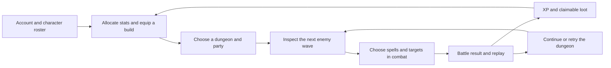

# Shards of Affinity — the game we have today

> Historical snapshot. Combat repairs, 3D, full runs, equipment, weighted routes, and production migration work have advanced since 9 September. Start with the [current project guide](../README.md) and [release evidence](../plans/008-production-evidence.md); deferred features and gaps below describe this document's original date.

**Current-state reference for future 2D and 3D prototypes · 9 September 2026**

Based on the local source at commit `351f33e` and the current working tree. This describes code and connected player flows, not a certification of the deployed game. Content factories were executed locally to check the inventory; a complete authenticated playthrough was not performed. Implementation gaps are called out explicitly.

Read this for the big picture. Use the companion [content catalog](game-content-catalog.md) for every dungeon wave, enemy, registered spell, passive, and equipment item. Use the source map at the end to find the rules behind each system.

## 1. The game in one paragraph

**Shards of Affinity is a dark-fantasy, small-party, turn-based dungeon RPG built around collecting abilities and composing character builds.** Players maintain a persistent roster, equip spells and passive skills, assign attributes, and send one or two characters through authored sequences of enemy encounters. During combat, they choose abilities and targets in an agility-ordered turn queue. Damage, healing, control effects, cooldowns, resource management, and random rolls create the tactical decisions. Defeated enemies supply experience and collectible rewards that feed back into the roster. The current presentation is a browser interface of character cards, menus, status bars, and battle events.

The strongest design identity already visible in the code is **learning and collecting the tools enemies use, then combining those tools in a small party**. There are no character classes restricting builds. Physical attacks are part of the same “spell” system as magic.

Dungeon attrition is part of the existing product language and stored data model. However, health and mana carryover is currently disconnected at battle startup. A prototype must choose whether to reproduce the fresh-resource behavior or implement the intended attrition loop.

### At a glance

| Area | Current scope |
| --- | --- |
| Player objective | Win individual battles, clear dungeon waves, improve characters and collections. No global campaign ending is implemented. |
| Party | One or two characters per dungeon; either one owner's characters or characters belonging to different users. |
| Combat | Sequential turns; agility determines order; human-controlled characters face automated enemies. |
| Spatial rules | No coordinates, movement, range, collision, facing, cover, or line of sight. Targets are entities on teams. |
| Content | 6 dungeons, 25 configured encounter waves, 22 enemy types, 39 registered spell types, 10 passive types, 1 equipment type. These are definition counts; acquisition and execution gaps are documented below. |
| Character build | 4 core attributes; up to 4 equipped collectible spells plus automatic Basic Attack; passive skills and equipment. |
| Persistence | Accounts, characters, collections, loadouts, dungeon records, battle results, and unclaimed rewards. |
| Social | Shared battles, character search for party formation, battle-local chat, and battle viewing/replays. |
| Current format | React browser game with a server-authoritative TypeScript combat engine. |

## 2. The player journey

1. **Sign in and establish a roster.** Clerk handles authentication. The first creation of the database user grants Cinder Wisp, Aqua Wave, and Battle Roar as starter spell inventory. Character creation gives a random name that can later be changed. The roster creation button also attempts a wallet transaction; this is an incomplete integration described below.
2. **Prepare a character.** Inspect attributes and experience, spend available stat points, equip or remove spells, choose owned passives, and assign equipment. Collections belong to the account; individual copies are assigned to characters.
3. **Choose an expedition.** The dungeon board presents recommended and other dungeons, runs currently in battle, unfinished runs, and cleared runs. Its recommended level bands are suggestions, not entry requirements.
4. **Select one or two characters.** The party dialog includes the user's roster and a name search across characters. This permits a party spanning accounts, but there is no invitation/acceptance lobby.
5. **Start an encounter.** The dungeon detail page shows the party and current enemy wave. Each wave is a separate battle, started explicitly. Existing battles can be resumed from the run.
6. **Play turns.** Select an available spell, select its required targets, and let the server resolve it. Enemy turns run automatically until another character needs input. A user controls only their own characters' turns.
7. **Review and collect.** A win/loss notification leads to a replay view. The completion workflow awards XP to surviving characters and creates account-specific loot bundles from defeated enemies. Claiming a bundle moves its collectible entries into inventory.
8. **Continue, retry, or start another run.** A victory advances the dungeon, and winning its final wave marks it cleared. A defeat does not intentionally advance the wave. Runs can be removed by their creator. Retry accounting has a defect, so failure recovery is not yet a dependable finished loop.

There is no implemented walking between rooms, route choice, map exploration, town simulation, or narrated quest sequence between these steps.

## 3. Characters and builds

New characters start at **level 1, 0 XP, 100 maximum HP, 50 maximum mana, and 10 in each core attribute**. They receive Basic Attack automatically when reconstructed for play. Starter collectible spells belong to the account and must be equipped.

| Attribute | Actual role |
| --- | --- |
| Strength | Increases damage for spells whose formulas explicitly scale with strength. |
| Intelligence | Increases selected damage/healing formulas, sets base maximum mana when allocating stats, and drives turn mana regeneration. |
| Vitality | Sets base maximum HP when allocating stats, drives character turn healing, and scales several attacks and defensive abilities. |
| Agility | Determines combat turn order and scales selected attacks. It does not implement evasion or movement speed. |

**Build freedom:** there are no class, race, weapon-class, or affinity requirements for equipping spells. Roles such as damage dealer, healer, controller, or durable support emerge from chosen stats and abilities; they are interpretations of the available tools, not formal classes.

**Loadout limits:** the server allows four equipped collectible spell copies. Basic Attack is added separately, giving up to five actions in a normal full loadout. Each owned copy has its own identity and equipped character; duplicate types are grouped in inventory. No passive-slot cap is enforced in the current equip operation. Equipment replaces the current item occupying its slot.

**When a build changes:** stat/loadout operations do not enforce a dungeon or active-battle lock. A running battle holds instantiated characters, while later battle setup or reconstruction reads the current database build. Between-wave changes can therefore be picked up, and a reconstructed battle can differ from its original build. There is no reliable immutable “loadout for this run” contract yet.

**Equipment:** nine slots exist: weapon, armor, ring, amulet, boots, gloves, helmet, cloak, and belt. Only **Int Armor** is currently defined; it occupies armor and adds 10 intelligence in battle. There is no completed equipment upgrade, durability, crafting, or random-affix system.

**Additional combat attributes:** armor, magic resistance, their penetration counterparts, critical chance/damage, lifesteal, omnivamp, regeneration, and Blessed. Additive modifiers are applied before multiplicative modifiers. The engine's `omnivamp` branch currently heals from magical damage; `lifesteal` heals from physical damage.

**Affinities:** fire, lightning, earth, water, and dark have data fields and can be inspected. They are not currently a working elemental advantage/resistance system. Spell names and visual themes do not create elemental damage rules: the active damage types are physical and magical.

Sources: [character creation and progression](../apps/server/src/game-usecases/character.ts), [character reconstruction](../apps/server/src/game-usecases/entity-factory.ts), [entity rules](../apps/game/src/base-entity.ts), [entity types](../apps/game/src/entity-types.ts).

## 4. Combat and tactical mechanics

### Turn structure

“Round” has two meanings in the existing code. A **dungeon wave** is one encounter in a run. A **combat round** is one traversal of the battle turn queue. This document uses those two phrases to keep them distinct.

At the start of each combat round, living entities are ordered by descending agility. Stun and charge effects can remove turns. Additional-action effects can append another turn. Agility changes normally affect the next calculated queue; characters do not move around a battlefield.

The usual action cycle is upkeep/regeneration → spell and target selection → resolution → cooldown/effect end step → next entity. The WebSocket wrapper advances the simulation; it waits for human input and automatically processes enemies. There is no implemented action timer, dodge timing, active-time gauge, or reflex-based combat. The “real-time” element is network updates and animated event playback.

### Decisions the player actually makes

- Which enemy to focus, and whether to spend a turn on damage, healing, protection, or control.
- Whether to spend mana now or use a free attack while expensive abilities recover.
- Whether to spend a long cooldown on an immediate threat or preserve it for later in the battle.
- How to combine single-target attacks, whole-team attacks, debuffs, stuns, and recovery across two characters.
- Whether a delayed burst, extra future action, reflection stance, or damage-and-heal ability is worth its cost.

The tactical depth comes from **build composition, target priority, resource use, and turn denial/manipulation**. “AoE” currently means a set of entities, usually all enemies or allies; it has no radius or geometric shape.

### Core rules

| Mechanic | Current rule |
| --- | --- |
| Legal cast | Caster must be alive, have enough mana, have zero current cooldown, and be next in the queue. The server wrapper has an invalid-cast turn-advance caveat. |
| Targeting | One ally, one enemy, all allies, all enemies, self, or custom random selection. Ally targeting can include the caster. |
| Basic Attack | Free, no cooldown, single enemy, 0–15 raw physical damage. It has no automatic strength scaling. |
| Spell power | Spell-specific base ranges plus explicit attribute scaling; some abilities use special formulas or multiple hits. |
| Randomness | A roll from 0 through 20 affects ranged values; Blessed increases it up to 20. Critical and effect chance rolls are separate. This is not a conventional 1–20 accuracy check. |
| Defense | Physical damage subtracts armor minus armor penetration. Magical damage subtracts magic resistance minus magic penetration. Final damage is rounded and clamped to at least zero. |
| Critical hits | Critical chance is checked and damage uses a critical multiplier; the base critical-damage attribute lookup is incomplete. |
| Regeneration | Ordinary character upkeep uses vitality/2 HP and intelligence/5 mana, rounded through healing rules. Enemy base HP regeneration is 2. Maximums cap recovery. Several regeneration modifiers are currently bypassed. |
| Cooldowns | Decrease at the caster's turn end. A cooldown of 1 means one intervening own turn before reuse; it is not one second. Extra turns therefore interact with cooldowns. |
| Victory/defeat | Battle ends when one team has no living entities. Death removes an entity's queued actions; there is no roster deletion or implemented permadeath rule. |

For example, casting a cooldown-1 spell on your first turn makes it unavailable on your second turn and available again on your third, assuming ordinary turn progression.

### Status and special mechanics present in active content

Direct physical/magical damage; direct healing; damage that heals its caster; repeated strikes; random-target attacks; damage over time; stat buffs and debuffs; armor reduction; increased damage taken; stun; charged attacks; extra actions; reflection; defensive cleansing; and conditional healing all have implementations in registered content. Whole-party shielding and reactive healing over time also have definitions, but their current paths contain failures described in section 9.

Duration handling mixes target turn-end and combat-round hooks. A future renderer should display the engine's state rather than independently deciding when an effect ends.

**Enemy behavior:** the default AI chooses the first castable spell in its configured list, then randomly chooses legal targets using the battle RNG. Spell order is therefore a behavior priority list. Enemies generally fall back to Basic Attack. This is not a planner that evaluates the best move or consistently heals the weakest ally.

Sources: [battle manager](../apps/game/src/bm.ts), [spell rules](../apps/game/src/spells/base/base.spell.ts), [damage/healing resolution](../apps/game/src/calculator.ts), [enemy behavior](../apps/game/src/enemies/base/base.enemy.ts), [battle driver](../apps/server/src/durable-objects/battle-ws.ts).

## 5. Dungeons and authored content

All six dungeon definitions are connected to the dungeon selection flow. Their enemy types and order are fixed; `rollEnemies` instantiates those definitions rather than procedurally generating encounters. Individual battles still contain randomness.

| Dungeon | Waves | UI level suggestion | Encounter identity / final wave |
| --- | ---: | --- | --- |
| Avalanche Lair | 2 | 1–2 | Introductory goblin and skeleton encounters; finishes with Ashen Skeleton + Goblin. The lizard-themed description does not match its current enemies. |
| Crypt of Forgotten Echoes | 4 | 2–3 | Undead, wisps, and Ghoul Knight Ivern. |
| Trial of the Ashen | 4 | 4–5 | Skeletons, a flame wraith, crawlers, and Emberbound Revenant. |
| Trial of the Nature | 5 | 5–6 | Golems, shamans, Elder Treant, and Hollowed Oakwarden. |
| Trial of the Storm | 5 | 6–7 | Fast hatchlings, wyverns, serpent, drake, and Thundermaw. |
| Trial of the Tides | 5 | 7–9 | Fishfolk, Water Elemental, and Commander Kelvaris, Tidepiercer. |

Every dungeon caps the party at two. The largest configured enemy wave has four enemies. Larger named enemies act through the same spell/passive system as ordinary enemies; there is no separate boss-phase framework. No level gates, keys, stamina cost, prerequisite clears, difficulty selection, or procedural branching are enforced by dungeon entry.

The complete wave lists and enemy kits are in the [content catalog](game-content-catalog.md).

Sources: [dungeon definitions](../apps/game/src/dungeons), [dungeon board and recommendation bands](../apps/client/src/routes/dungeons/index.tsx), [dungeon operations](../apps/server/src/game-usecases/dungeon-manager.ts).

## 6. Rewards, progression, and the economy

**Experience is per character.** At battle completion, each surviving party character receives the full sum of XP from defeated enemies; XP is not divided among the party. Dead characters are skipped. The threshold for the next level is `current level × 100 XP`. Each level gives four allocatable stat points. The current function processes at most one level-up per XP award and retains excess XP.

**Stat allocation changes permanent character values.** Spending points increases the chosen attributes and recalculates base HP as `vitality × 10` and base mana as `intelligence × 5`. Equipment and temporary buffs do not automatically recalculate those maxima.

**Loot is per participating account.** Each distinct owner gets their own rolls against defeated enemies' loot tables. Two characters owned by one user still produce one account's reward bundle. Two owners produce separate bundles. These can include spell copies, passive copies, and equipment. Claiming grants all collectible entries and removes the bundle.

**Enemy spells are a collection source.** By default, an enemy drops the non-basic spells it uses, each independently at the tier's rate. Explicit loot tables replace that default. The six tier rates are E 20%, D 10%, C 6%, B 3%, A 1%, and S 0.3%. These are current configuration values, not evidence of a balanced progression curve. Most registered spells are tier A.

Concrete early rewards make the intended collection loop visible: Goblins have separate 60% rolls for Int Armor and Armor Up; Ashen Skeleton guarantees Splinter Shot; Lurking Flame Wraith has 10% Cinderbrand and 20% Splinter Shot rolls.

**Acquisition coverage matters:** 27 spell types appear in current enemy loot tables; three of those also arrive as starter gifts. Basic Attack is automatic. The visible “Create spells” button grants seven additional, fixed ability types without an in-game cost. Four registered spells have no current acquisition path. Of ten passive definitions, only Armor Up appears in current player loot; several others are enemy abilities. The catalog identifies each case.

**Gold is incomplete.** Battles calculate and display a gold amount, but claiming does not credit an account/character balance, and the schema has no spendable gold wallet. No shops, buying/selling, trading, crafting, upgrade spending, or monetization loop is implemented in these paths.

Sources: [XP curve](../apps/game/src/utils/xp-curve.ts), [completion workflow](../apps/server/src/workflows/battle-done.workflow.ts), [reward generation](../apps/server/src/game-usecases/dungeon-manager.ts), [loot claims](../apps/server/src/game-usecases/loot-manager.ts), [default drop rates](../apps/game/src/utils/loot.ts), [starter grants](../apps/server/src/lib/context.ts), [manual spell grant](../apps/server/src/routers/index.ts).

## 7. Multiplayer, persistence, and player-facing features

| Feature | What currently exists |
| --- | --- |
| Roster management | Create and rename characters; inspect levels, XP, attributes, spells, passives, and equipment. |
| Spell archive | Owned spell/passive inventories grouped by type, duplicate counts, descriptions, and the manual spell-grant button. |
| Item inventory | Owned equipment, item details, and assignment through the character screen. |
| Dungeon board | Recommendations, other available dungeons, in-battle runs, unfinished runs, cleared history, and creator-only run removal. |
| Shared party battles | A party can contain characters from different accounts. Each owner submits their own character's actions. No ready check or disconnect substitute AI is implemented. |
| Battle inspection | Ally/enemy cards, HP/mana changes, active-turn/turn-order display, ability availability, cooldowns, roll/critical feedback, effect badges, target selection, and attribute/spell hover details. |
| Battle chat | Battle-specific live text messages over a separate WebSocket. Messages are stored server-side, but old history is not sent to a newly connected chat client. |
| Battle viewing | The home page lists recently active battles. That query is not filtered to the current user's characters. Logged-in viewers can connect, but cannot cast for another owner's character. |
| Replay | Saved results, an event scrubber, reconstructed entity state, and a raw event payload viewer. This is also a useful development tool. |
| Account/session | Clerk sign-in/sign-up and user menu; persisted game data sits in PostgreSQL. |
| Wallet integration | RainbowKit/Wagmi connection page and an Avalanche Fuji character-mint attempt. No completed bridge between token ownership and the persisted RPG character is evident. |

**State lifetimes:** persistent character stats, inventory ownership, and equipped assignments outlive runs. Dungeon records retain wave progress and reported HP/mana. Temporary combat effects and cooldowns belong to a battle and are reconstructed for a new one. Completed battles retain start data, participants, effect metadata, winner, and event history. Durable Object message storage supports rebuilding active battles, with reproducibility caveats below.

The current visual language uses dark stone/parchment panels, gold borders, fantasy typography, and icons. It is predominantly a menu/card interface. There is no playable rendered 2D/3D world, avatar locomotion system, or spatial interaction layer in the current game flow.

## 8. What is not an established current feature

Do not infer any of these from genre conventions, dependencies, names, or legacy classes:

- Free-roaming exploration, procedural maps, navigation, environmental puzzles, interactable objects, or spatial combat.
- A quest/campaign system, branching narrative, dialogue choices, named player classes, skill trees, or class unlocks.
- PvP matchmaking/ranking, guilds, friends/invites, or a shared MMO world.
- Crafting, shops, trading, auction houses, consumable potions, resource harvesting, or a working gold economy.
- A full elemental-affinity system, equipment progression across all nine slots, or collection access to every defined ability.
- Playable summoning, resurrection, or mind control. Supporting/legacy classes exist, including `deprecated.spells.ts`, but are outside the current registered spell set. Their existence is not an approved roadmap.
- On-chain character progression, tokenized loot, or a game economy built around blockchain ownership.

These can be future design choices. They should not be described as features already preserved by a new renderer.

## 9. Implementation gaps that affect the game picture

These are relevant source findings, not an exhaustive bug audit. They matter because they change what a prototype would actually be testing.

| Area | Evidence and implication |
| --- | --- |
| **Between-wave attrition** | `getDungeon` restores saved HP/mana, but `SyncFactory.add` saves only participant identities and `SyncFactory.get` creates fresh characters from base records. `BattleWebsocket.setupBm` uses those fresh characters. The next battle therefore does not receive the saved injury/mana state. Treat carryover as incomplete. |
| **Defeat/retry progression** | On a later win, `handleDungeonCleared` sets the wave index to the count of battle records, including losses. A loss followed by a win can skip waves or clear early. There is no distinct, polished run-failure/recovery state. |
| **Ability access and starter balance** | The free “Create spells” button grants high-tier abilities; several definitions have no normal acquisition source. It bypasses the loot progression the game otherwise suggests. |
| **Descriptions versus behavior** | Stone Bark targets self; Tidal Pulse targets all enemies; Storm Pulse samples all living entities, including allies; Torrent Spiral increases all damage taken, not specifically water damage. Tidepiercer's advertised defense-ignore proc and Deflecting Stance's advertised non-stacking rule are absent from their implementation. |
| **Fragile ability paths** | Aegis Wall constructs a shield that queries its target before a battle manager is assigned. Titan's Resurgence directly appends a healing effect without registering its normal lifecycle/source data. Final Verdict compares a percentage against `0.1`, producing a 0.1% threshold rather than a conventional 10% execute. Effect-origin lethal damage also needs attention: `Handler.damage` accesses `spell.config.id`, while effects carry `spellSourceId`. |
| **Displayed stats versus applied stats** | Upkeep bypasses the `healthRegen`/`manaRegen` attribute getters, so the associated passive modifiers do not change ordinary upkeep. The base-value switch omits `critDamage`. Affinity fields do not participate in active damage resolution. |
| **Turn acceptance** | `processSpellCast` advances the turn even if `safeCastSpell` rejects the cast. Initial upkeep and effect timing also need validation before treating the driver as a final rules specification. |
| **Reproducibility** | Battles use seeded randomness, but IDs use unseeded generation; reconstruction reloads mutable character data; Storm Pulse's description calculation consumes battle RNG. Same seed alone is not a guarantee of identical state or outcome. Rendering and inspection must not mutate simulation randomness in a future adapter. |
| **Wallet/character creation** | The database character is created before the client attempts minting. Missing wallet clients can interrupt the success callback after database creation. Keep this separate from the RPG's intended onboarding contract. |
| **Gold and content maturity** | Gold has no claim-to-balance path. Several placeholder descriptions conflict with content. Nine equipment slots should not be mistaken for nine completed equipment families. |

Relevant sources: [battle setup and turn driver](../apps/server/src/durable-objects/battle-ws.ts), [participant reconstruction](../apps/server/src/game-usecases/sync-factory.ts), [wave progression](../apps/server/src/game-usecases/dungeon-manager.ts), [combat calculator](../apps/game/src/calculator.ts), [shield effect](../apps/game/src/effect/max-hp-shield.effect.ts), [Titan's Resurgence](../apps/game/src/passive-skills/titans-resurgence.passive.ts), [Final Verdict](../apps/game/src/spells/final-verdict.ts), [Storm Pulse](../apps/game/src/spells/storm-pulse.ts), [character creation UI](../apps/client/src/routes/characters/index.tsx).

## 10. What this means for a 2D or 3D prototype

**A presentation prototype can reuse the combat model.** A scene can place sprites or models in formation, animate spell events, show damage/healing, and let the player select targets without adding position to the rules. The visible locations would be presentation choices. Actual movement, cover, range, collisions, or terrain bonuses would be new mechanics requiring new simulation rules.

Before comparing renderers, choose and document a baseline: for each consequential defect in section 9, explicitly reproduce it, fix it in the shared baseline, or exclude that case from the experiment. The table below describes mechanics to hold constant across that chosen baseline, not a requirement to preserve bugs.

| Preserve for a comparable prototype | Free to explore visually | Requires an explicit design decision |
| --- | --- | --- |
| One- or two-character party and authored enemy waves | Side-view, top-down, isometric, or a fixed 3D camera | Tactical movement, grid/range/cover rules |
| Ability identities, costs, targeting, cooldowns | Sprites, models, character silhouettes, portraits | Action combat, active-time combat, or timed inputs |
| Attribute/loadout decisions and enemy spell priorities | Arena layout, animation, VFX, sound, UI placement | Changed party size, enemy AI, or progression balance |
| Ordered, authoritative battle events | Cinematic timing and playback speed | HP/mana carryover versus full recovery between waves |
| XP, collectible ownership, equip/claim loop | Dungeon board as a map, diorama, or menu | Rooms, exploration, branching routes, and campaign structure |

The reusable center is `apps/game`: entities, spells, modules, effects, passives, items, dungeon definitions, and the battle manager. The current server owns turn driving, character/enemy assembly, persistence, loot awards, and network synchronization. The client reconstructs display state from events. A new scene renderer can sit on this boundary, but the package is not yet a drop-in complete game backend: some factories are under `apps/server`, client code imports server internals, and serialization restores class instances.

### A useful first comparison slice

This is a proposed evaluation setup, not a feature commitment:

1. Build a fixture adapter that captures an initial entity/build snapshot and supplies fixed identities, RNG state, scripted actions, and reward outcomes for both visual versions. Inspection must leave RNG unchanged. Matching the seed alone is insufficient in the current app; this adapter does not exist yet.
2. Include party preparation, Avalanche Lair's two encounters, result feedback, one reward claim, and an equip change. This exercises the complete loop at small scope.
3. Add a separate controlled encounter demonstrating healing, an AoE, stun, and a cooldown. The introductory lair alone does not exercise the richer combat system.
4. Keep the turn resolver, state transitions, and reward fixtures constant. Isolate any necessary fixes and document them as baseline changes.
5. Compare whether players can identify the active entity, legal targets, next turns, ability cost, result of an action, effect duration, and reward usefulness. Also compare pacing and character/enemy readability.

A local scene prototype could use explicit in-memory fixtures to avoid accounts, wallets, and deployment during visual evaluation. That would be a prototype adapter to build, not an offline mode already present in the app. If the prototype instead uses the live server, it inherits its authentication and persistence requirements.

### Decisions to settle before adding new mechanics

- Is the desired identity primarily build-building and encounter tactics, or should exploration become equally important?
- Should injury and mana persist across waves, and what does defeat cost? The current split between stored data and battle startup does not answer this consistently.
- Is one player commanding both characters the default, or is shared ownership/co-op central?
- Which starter abilities, loot rates, and passive limits define normal progression once manual grants are removed?
- Are affinities intended to become a combat system, or remain setting/visual themes?
- Does a 2D/3D comparison change presentation only, or deliberately test spatial gameplay? Keep those experiments distinguishable.

## 11. Source map for the next prototype

| Need | Start here |
| --- | --- |
| Combat state, turn queue, death, battle end | [BM](../apps/game/src/bm.ts), [battle interfaces](../apps/game/src/battle-types.ts) |
| Stats, resources, modifiers, characters | [BaseEntity / Character](../apps/game/src/base-entity.ts), [entity types](../apps/game/src/entity-types.ts) |
| Cast legality, costs, targeting, roll rules | [BaseSpell](../apps/game/src/spells/base/base.spell.ts) |
| Damage, healing, effects | [calculator / Handler](../apps/game/src/calculator.ts), [modules](../apps/game/src/modules), [effects](../apps/game/src/effect) |
| Ability and enemy content | [spells](../apps/game/src/spells), [passives](../apps/game/src/passive-skills), [enemies](../apps/game/src/enemies), [enemy factory](../apps/server/src/game-usecases/enemy-factory.ts) |
| Dungeon content and lifecycle | [definitions](../apps/game/src/dungeons), [manager](../apps/server/src/game-usecases/dungeon-manager.ts), [router](../apps/server/src/routers/dungeon-router.ts) |
| Progression and loadouts | [character use cases](../apps/server/src/game-usecases/character.ts), [entity factory](../apps/server/src/game-usecases/entity-factory.ts) |
| Rewards | [completion workflow](../apps/server/src/workflows/battle-done.workflow.ts), [loot manager](../apps/server/src/game-usecases/loot-manager.ts) |
| Live battle protocol and execution | [battle WebSocket](../apps/server/src/durable-objects/battle-ws.ts), [SyncFactory](../apps/server/src/game-usecases/sync-factory.ts) |
| Renderable events and display state | [timeline events](../apps/game/src/timeline-events.ts), [stats timeline](../apps/client/src/routes/battle/-hooks/use-stats-timeline.ts), [live client hook](../apps/client/src/routes/battle/-hooks/use-battle.ts), [battle renderer](../apps/client/src/routes/battle/-battle-render.tsx) |
| Saved battles and replay | [battle storage](../apps/server/src/game-usecases/bm-storage.ts), [replay screen](../apps/client/src/routes/battle/finished.$id.tsx) |
| Persistent model and class serialization | [database schema](../apps/server/src/db/schema.ts), [SuperJSON recipes](../apps/server/src/lib/superjson-recipes.ts) |

The repository uses Bun workspaces, React/Vite for the client, tRPC for application operations, Cloudflare Workers/Durable Objects for server and live battles, and PostgreSQL/Drizzle for persistence. The [README](../README.md) contains the development entry points. Preserve the combat and content rules deliberately; do not treat the present UI, debug grants, or implementation defects as implicit requirements for the next version.
