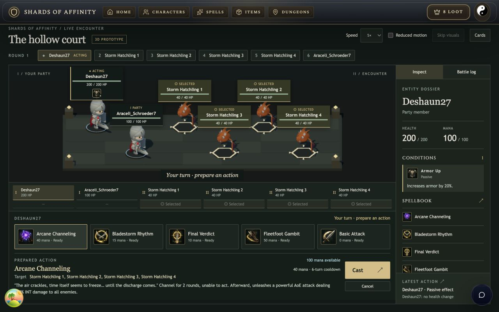
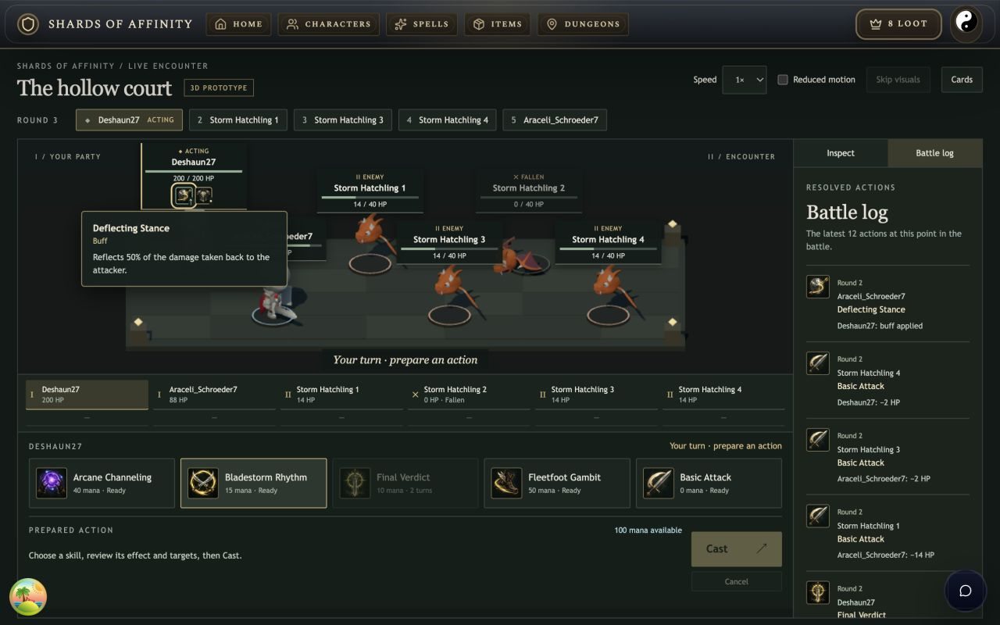
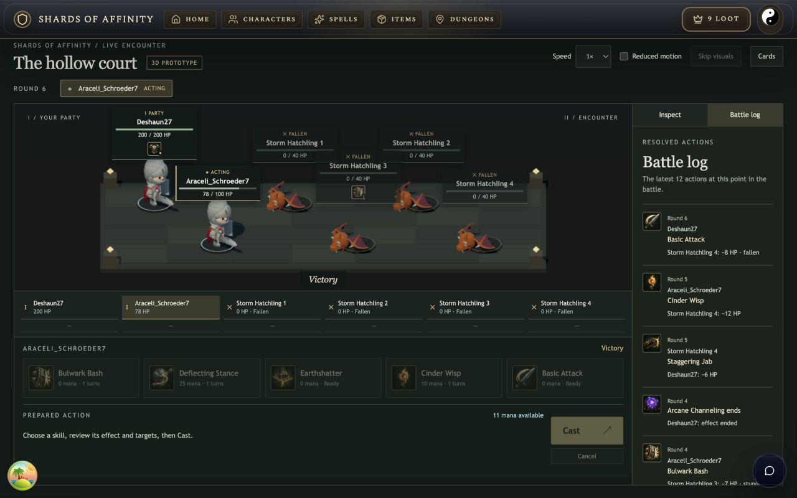

# Milestone 3 — skill artwork and readable combat

Completed locally on 2026-09-10. The battle now puts the selected skill's effect, mana cost, cooldown and exact legal targets beside Cast. The sidebar adds a recent-action log, and every entity's card sits above its miniature with condition icons, stack counts and descriptions.

## Open it

- [All 59 generated icons, at game sizes](http://127.0.0.1:3001/dev/skill-icons.html)
- [Portable six-entity replay](http://127.0.0.1:3001/dev/battle-replay.html)
- [Completed live encounter](http://127.0.0.1:3001/battle/finished/ni8jo13drsfn) — choose **3D replay prototype**.
- [Launch instructions](../threejs-battle-prototype.md)

The 3D presentation and development galleries remain development-only. Skill artwork is also used by the spell library, equipped character skills and existing Cards battle view.

## Artwork and conditions

The complete registry is covered: **39 active skills, 10 passives and 10 generic condition icons**. Each image was generated individually using OpenAI's built-in image generation tool, with a shared hand-painted fantasy direction and a separate subject prompt. The delivered set is **753,338 bytes**: 59 WebP images at 256 × 256, downsampled from the generated PNG originals. All assets were checked for dimensions and successful browser loading; the gallery shows 72, 40 and 20 pixel versions.

- [Prompt set](../../scripts/battle-icons.prompts.json)
- [Source and preparation notes](../../apps/client/public/icons/skills/v1/PROVENANCE.md)
- [Asset hashes and byte counts](../../apps/client/public/icons/skills/v1/build-report.json)
- [Full gallery capture](skill-gallery.jpg)

Condition IDs are associated with their recorded originating spell or passive. Effects created by another effect inherit its source artwork. Missing source metadata falls back to the appropriate generic condition; unknown skill IDs and failed image requests fall back to the generic passive icon.

Beneficial and harmful conditions have distinct border colors and up/down markers. Identical effects are grouped with a stack count. Up to five groups fit on a card; larger sets show four groups and an overflow control. Hover, focus or click opens the description, and Escape dismisses it. These are DOM controls with accessible names, independent of WebGL hit testing.

The source map explicitly preserves passive identities when a join event shares an ID with Basic Attack. This was caught in live verification and is covered by all relevant saved live recordings.

## Combat presentation

The prepared-action area shows the selected skill, its description, available mana, mana cost, cooldown and the actual selected target names. Changing skills clears the previous target selection through the existing session controller. Selection alone never casts. Targeting, ownership, available skills and accepted results remain server-authoritative.

The battle log contains the latest 12 resolved actions at the displayed event cursor. It includes skill artwork, caster, round, health actually gained or lost, conditions and deaths. Overkill is capped to the health lost, duplicate death notifications are omitted, and replaying an earlier prefix hides later results. Cooldown and regeneration events still update displayed resources but do not add separate log rows. The turn strip follows the action being presented while queued results play, then returns to the server's current turn order.

Normal presentation uses 540 ms for ordinary melee, 720 ms for ordinary spell casts, 660 ms for healing or protection, and 900 ms for major skills. Effect triggers use 360 ms, removals 140 ms and death notifications 280 ms. Consecutive cooldown/regeneration updates settle with the preceding action. Impact remains at 45% of the cue; animation and projectile timing follow the same duration.

For the portable 69-event recording, the nominal animation duration falls from **69,000 ms to 14,240 ms**, with 28 animated events. Raw event indexing and exact seek states remain available. This is presentation timing; it does not change combat, cooldown or regeneration rules.

## Live acceptance

Battle **ni8jo13drsfn**, the first wave of a new Trial of the Storm, used the existing Deshaun27 and Araceli_Schroeder7 against four Storm Hatchlings. All 10 casts were sent through the authenticated live UI at normal speed, with no Skip. The run used Basic Attack, Earthshatter, Final Verdict, Deflecting Stance, Bladestorm Rhythm, Cinder Wisp, Arcane Channeling and Bulwark Bash.

The persisted result contains 69 events and a TEAM_A victory:

| Entity | Health | Mana | State |
| --- | ---: | ---: | --- |
| Deshaun27 | 200 | 65 | Alive |
| Araceli_Schroeder7 | 78 | 11 | Alive |
| All four Storm Hatchlings | 0 | — | Fallen |

Verified in the live UI:

- All six miniatures, labels, skill buttons and Cast fit at 1280 × 800. With Arcane Channeling prepared, Cast occupied y=670.3–715.2.
- Switching from an area skill to Basic Attack discarded the previous four-target selection. A specific target and Cast were operated using Enter.
- Earthshatter's four results and Final Verdict's single-target kill appeared in the log against the correct entities.
- Armor Up, Deflecting Stance, Arcane Channeling and Bulwark Bash's stun displayed the proper icon and description on their affected cards.
- One idle WebSocket disconnect disabled casting. Reloading the same battle restored the exact current health and turn, and the encounter continued without resending an uncertain cast. The disconnect's underlying cause was not investigated in this presentation milestone.
- The saved result replay reached the same final health in reduced-motion mode.

The first wave is complete; no subsequent dungeon wave was started. The [portable live fixture](../../tests/battle/recordings/live-milestone-3.json) was exported read-only from local storage and the local development database, with account IDs replaced by `fixture-owner`. Its commands reproduce the persisted health, mana and winner from the frozen starting builds.

## Verification and performance

**46 tests passed, with 513 assertions across eight files.** Both client and server TypeScript checks passed. The production Vite build passed and contains all 59 static icons; its JavaScript excludes the 3D presentation. The existing large-bundle warnings remain.

Coverage includes every registered icon and asset checksum, source inheritance, passive identities, stacks, removals, log visibility while seeking, capped healing and overkill, bookkeeping coalescing, appended results, reconnects, normal/fast/reduced playback, skip, and restoration of four authenticated live recordings.

React Doctor: **63/100** for the tracked diff (previous milestone 62), and **55/100** for the full client (previous milestone 54). The full scan reports 94 warnings and no errors, the same warning count as milestone 2. New bounded lookups operate on the five equipped skills or the displayed effect list; the surrounding existing warnings were not expanded into unrelated cleanup.

Frame measurements used the same local MacBook Pro M1 Max, Chrome 152 and a controlled 1280 × 800 viewport. The active sample contains 1,800 frames across repeated normal-speed runs of the portable recording. No build or test suite ran during that sample.

| Active playback | Milestone 2 | Milestone 3 |
| --- | ---: | ---: |
| Median frame time | 16.7 ms | 16.7 ms |
| 95th percentile | 19.7 ms | 19.4 ms |
| Maximum | 28.1 ms | 28.7 ms |

This remains near 60 fps at the median, with occasional slower frames. It is not a strict 60 fps guarantee. The sample contains spell, effect-trigger, removal and death cues; bookkeeping now completes without its own animated interval. [Raw measurements](metrics-1280-active.json).

Three full scene unmount/remount cycles, each allowing the final-owner eviction delay, returned to **108 draw calls, 67 geometries and 21 textures** at the completed encounter. Model requests increased from four to six to eight, confirming reload after release, while resource counts stayed flat. [Cycle measurements](resource-cycles.json). These are the same completed-scene counts recorded in milestone 2. The two model files still total 717,404 bytes.

## Boundaries

Remaining effect duration is not invented: stored metadata describes an effect's original duration, and different effect types have different lifecycle rules. The cards show only currently active recorded IDs, source artwork, stacks and the recorded description. They also retain a condition on a fallen entity when the authoritative history retains it.

The new work is local and uncommitted. No gameplay engine, server command, authentication, reward or dungeon progression rules were changed for this milestone. [Milestone 2](../threejs-milestone-2/README.md) contains the unchanged model provenance and earlier fallback checks.
